# User Flows: AI Finance — от первого запуска до использования AI

**Версия:** 0.1 (черновик для обсуждения)
**Автор:** UX Designer
**Дата:** 2026-07-16
**Статус:** на согласование
**Связанные документы:** [01_PRD.md](01_PRD.md), [02_Market_Research.md](02_Market_Research.md), [03_User_Personas.md](03_User_Personas.md)

> Документ описывает полный путь пользователя (end-to-end user flow) от первого открытия приложения до регулярного использования AI-ассистента, с описанием каждого экрана. Диаграммы — в формате Mermaid. Уровень детализации — для передачи в разработку (Flutter) и дальнейшей проработки UI Designer'ом.

## Легенда

| Обозначение | Значение |
|---|---|
| 🆓 | Доступно в Free-тарифе |
| 💎 | Требует Premium (см. [01_PRD.md, раздел 7](01_PRD.md#7-разделение-free--premium)) |
| 🤖 | Экран/шаг с участием AI |

---

## 0. Карта разделов документа

1. Полный путь пользователя (мастер-диаграмма)
2. Первый запуск и Onboarding
3. Регистрация и вход
4. Первичная настройка аккаунта
5. Главный экран (Dashboard)
6. Добавление транзакции (ручной ввод / OCR / голос)
7. Бюджеты и цели накоплений
8. Трекер рассрочек/BNPL
9. Семейный/общий бюджет
10. AI-ассистент
11. Отчёты и аналитика
12. Настройки и переход на Premium

---

## 1. Полный путь пользователя (мастер-диаграмма)

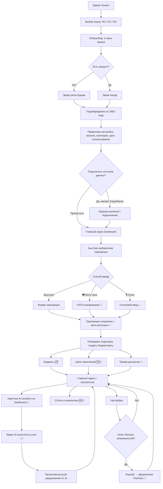

---

## 2. Первый запуск и Onboarding

### Экран 1 — Splash Screen 🆓
- **Назначение:** бренд-заставка при холодном старте, пока грузятся начальные данные (проверка сессии, локали).
- **Элементы:** логотип AI Finance, минималистичный фон, без кнопок.
- **Действие пользователя:** нет (автопереход через 1–2 сек).
- **Переход:** если сессия уже есть → сразу на Dashboard (экран 5.1); если нет — на выбор языка.

### Экран 2 — Выбор языка 🆓
- **Назначение:** выбрать язык интерфейса до первого показа контента (RU / KZ / EN), т.к. это ключевое дифференцирующее УТП продукта.
- **Элементы:** три флага/кнопки — Русский / Қазақша / English, определяется по умолчанию из локали устройства.
- **Действие:** выбор языка (можно сменить позже в настройках).
- **Переход:** Onboarding value-экраны.

### Экраны 3.1–3.3 — Value Proposition (карусель) 🆓
Три свайпаемых экрана, объясняющих ценность продукта до регистрации (снижают порог входа "без риска" из PRD):
- **3.1:** "Фиксируй траты за секунды" — иллюстрация фото чека/голосового ввода.
- **3.2:** "Держи под контролем все рассрочки" — иллюстрация сводной карты долгов (ключевое УТП).
- **3.3:** "AI-помощник, который говорит на твоём языке" — иллюстрация чата с ассистентом.
- **Элементы:** иллюстрация, заголовок, короткий текст, индикатор точек, кнопка "Далее"/"Пропустить".
- **Действие:** свайп или "Пропустить".
- **Переход:** экран выбора авторизации.

### Экран 4 — Начать пользоваться 🆓
- **Назначение:** развилка между регистрацией и входом, а также предложение "продолжить без аккаунта".
- **Элементы:** кнопки "Создать аккаунт", "Войти", ссылка "Продолжить как гость" (ограниченный локальный режим без синхронизации — снижает трение первого использования).
- **Действие:** выбор пути.
- **Переход:** Регистрация (3.1) / Вход (3.2) / сразу на первичную настройку в гостевом режиме.

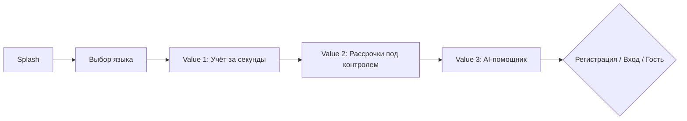

---

## 3. Регистрация и вход

### Экран 3.1 — Регистрация 🆓
- **Назначение:** создать аккаунт по номеру телефона (основной способ в KZ) или email.
- **Элементы:** поле номера телефона (+7 по умолчанию) или переключение на email, чекбокс согласия с политикой конфиденциальности, кнопка "Получить код".
- **Действие:** ввод телефона/email, согласие с условиями.
- **Переход:** экран подтверждения OTP.

### Экран 3.2 — Вход 🆓
- **Назначение:** вход существующего пользователя.
- **Элементы:** поле телефона/email, кнопка "Получить код входа", ссылка "Регистрация".
- **Переход:** OTP.

### Экран 3.3 — Подтверждение по SMS-коду 🆓
- **Назначение:** верификация номера (JWT + Refresh Token выдаются после успешной проверки, см. архитектуру в CLAUDE.md).
- **Элементы:** 6 полей ввода кода, таймер повторной отправки, авто-подстановка кода из SMS.
- **Действие:** ввод кода.
- **Переход (новый пользователь):** первичная настройка. **Переход (существующий):** сразу на Dashboard.

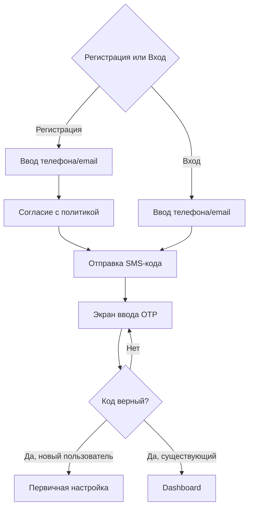

---

## 4. Первичная настройка аккаунта

### Экран 4.1 — Основная валюта и регион 🆓
- **Назначение:** задать базовую валюту учёта (KZT по умолчанию) и регион для локальных категорий расходов.
- **Элементы:** выбор валюты (KZT/USD/RUB/EUR/…), переключатель "буду использовать несколько валют" (влияет на дальнейшую доступность мультивалютных целей — 💎).
- **Переход:** выбор цели использования приложения.

### Экран 4.2 — "Зачем вам AI Finance?" 🆓
- **Назначение:** персонализация онбординга и будущих AI-инсайтов на основе выбранной цели (влияет на выбор персоны из [03_User_Personas.md](03_User_Personas.md)).
- **Элементы:** карточки-варианты: "Понять, куда уходят деньги", "Накопить на цель", "Разобраться с рассрочками/долгами", "Вести бюджет с семьёй/партнёром", "Инвестиции и net worth". Можно выбрать несколько.
- **Переход:** предложение подключить источник данных.

### Экран 4.3 — Подключить источник данных 🆓
- **Назначение:** ключевая развилка "постепенного доверия" из PRD — банковская синхронизация опциональна, а не обязательна.
- **Элементы:** карточки "Импортировать выписку Kaspi/банка (PDF/CSV)", "Сканировать чеки камерой", "Вести вручную/голосом", кнопка "Настрою позже".
- **Действие:** выбор одного или нескольких способов.
- **Переход:** если выбран импорт → экран загрузки выписки; иначе → сразу на Dashboard с пустым состоянием.

### Экран 4.4 — Импорт выписки 🆓🤖
- **Назначение:** загрузка PDF/CSV выписки Kaspi/банка, парсинг и предпросмотр транзакций перед сохранением.
- **Элементы:** кнопка загрузки файла, индикатор обработки, список распознанных транзакций с предложенными AI категориями, кнопка "Подтвердить и сохранить".
- **Переход:** Dashboard с уже заполненной историей.

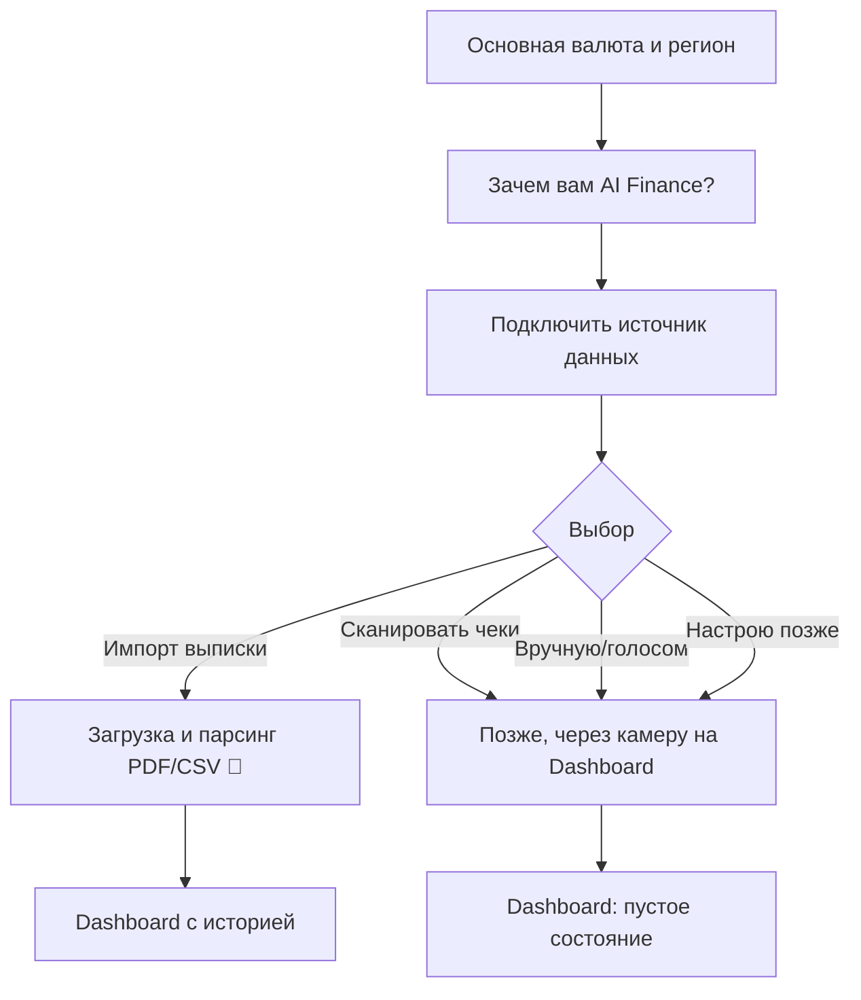

---

## 5. Главный экран (Dashboard)

### Экран 5.1 — Dashboard 🆓
- **Назначение:** центральный экран — сводка состояния финансов и точка входа во все остальные разделы, включая AI.
- **Элементы:**
  - Верхний блок: баланс/остаток бюджета на текущий месяц, переключатель периода
  - Карточка "AI-инсайт дня" 🤖 (например: "Вы тратите на такси на 20% больше обычного") — тапом ведёт в чат с ассистентом
  - Виджет активных бюджетов по категориям (прогресс-бары)
  - Виджет ближайших платежей по рассрочкам 💎 ("через 2 дня — платёж 15 000 ₸ по Kaspi Рассрочке")
  - Лента последних транзакций
  - Плавающая кнопка "+" для быстрого добавления транзакции
  - Нижняя навигация: Главная / Бюджеты / Добавить (+) / AI / Ещё
- **Действия:** тап по любому виджету — переход в соответствующий раздел; тап "+" — добавление транзакции.
- **Переход:** любой из разделов 6–11.

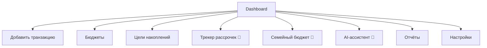

---

## 6. Добавление транзакции

### Экран 6.0 — Выбор способа ввода 🆓
- **Назначение:** точка входа, открывается по кнопке "+".
- **Элементы:** крупные иконки-кнопки: "Вручную", "📷 Фото чека", "🎙 Голосом", "Из шаблона" (частые операции — такси, обед).
- **Переход:** соответствующий под-экран.

### Экран 6.1 — Ручной ввод 🆓
- **Элементы:** переключатель Доход/Расход, поле суммы с цифровой клавиатурой, выбор категории (сетка иконок), выбор счёта/кошелька, дата (по умолчанию сегодня), поле заметки, кнопка "Сохранить".
- **Действие:** заполнение полей.
- **Переход:** экран подтверждения → Dashboard.

### Экран 6.2 — Фото чека (OCR) 🆓 (лимит) / 💎 (безлимит) 🤖
- **Назначение:** сканирование чека через камеру, распознавание через Google Vision.
- **Элементы:** камера с рамкой для чека, кнопка съёмки, после съёмки — экран предпросмотра с распознанными позициями (список товаров + сумма + предложенная категория), возможность вручную поправить.
- **Действие:** снять фото → проверить/поправить распознанное → "Сохранить".
- **Переход:** экран подтверждения → Dashboard. При исчерпании бесплатного лимита сканирований — переход на Paywall (раздел 12).

### Экран 6.3 — Голосовой ввод 💎 🤖
- **Назначение:** быстрая фиксация траты голосом ("Потратил 5000 тенге на такси") через Whisper.
- **Элементы:** экран с анимацией распознавания речи, после распознавания — карточка с результатом (сумма, категория, описание) для подтверждения.
- **Действие:** произнести фразу → подтвердить/исправить → "Сохранить".
- **Переход:** Dashboard.

### Экран 6.4 — Подтверждение сохранения 🆓
- **Элементы:** короткий тост/анимация "Транзакция сохранена", опционально предложение "Добавить в бюджет [категория]?", если такого бюджета ещё нет.
- **Переход:** автоматически на Dashboard.

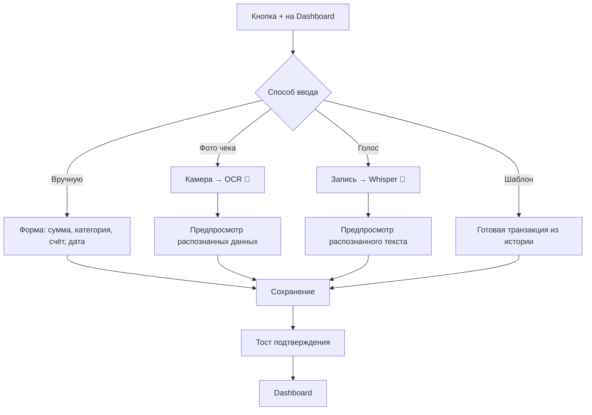

---

## 7. Бюджеты и цели накоплений

### Экран 7.1 — Список бюджетов 🆓 (до 8 категорий) / 💎 (безлимит)
- **Элементы:** карточки категорий с прогресс-баром (потрачено/лимит), цветовая индикация (зелёный/жёлтый/красный при приближении к лимиту), кнопка "+ Новый бюджет".
- **Переход:** экран создания бюджета или детали существующего.

### Экран 7.2 — Создание/редактирование бюджета 🆓
- **Элементы:** выбор категории, поле лимита на период, выбор периода (месяц/неделя — под гибкий доход, см. персону "фрилансер"/"таксист"), переключатель уведомлений о приближении к лимиту.
- **Переход:** список бюджетов.

### Экран 7.3 — Список целей накоплений 🆓 (1 цель) / 💎 (безлимит + мультивалюта)
- **Элементы:** карточки целей с прогресс-баром, суммой накоплено/нужно, сроком; для Premium — индикатор валюты цели (KZT/USD/золото) и прогноз с поправкой на курс.
- **Переход:** создание цели / детали цели.

### Экран 7.4 — Создание цели 🆓/💎
- **Элементы:** название цели, целевая сумма, валюта (💎 для не-KZT), срок, начальная сумма, опция "копить автоматически откладывая % от каждого дохода".
- **Переход:** список целей.

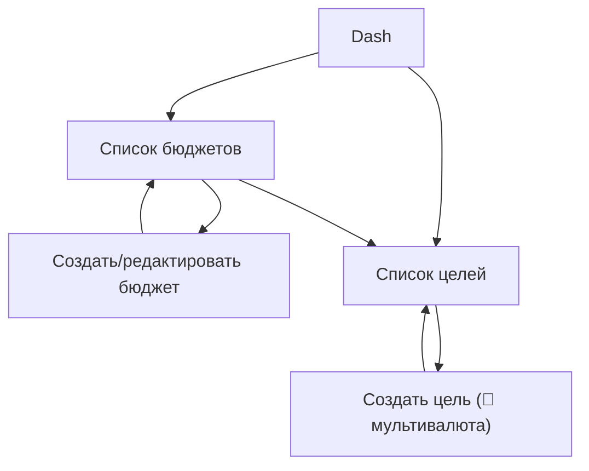

---

## 8. Трекер рассрочек / BNPL (ключевое УТП, 💎)

### Экран 8.1 — Сводная карта рассрочек 💎
- **Назначение:** решает боль персон 8 и 14 из [03_User_Personas.md](03_User_Personas.md) — "невидимый долг".
- **Элементы:** суммарная долговая нагрузка сверху (сколько всего должен по всем активным рассрочкам), список активных рассрочек карточками (магазин/товар, осталось платежей, ближайшая дата и сумма), календарь платежей на месяц вперёд.
- **Переход:** детали рассрочки / добавление новой / калькулятор.

### Экран 8.2 — Добавление рассрочки вручную 🆓 (базовая карточка) / 💎 (в общей карте с аналитикой)
- **Элементы:** магазин/название покупки, общая сумма, количество платежей, дата первого платежа, банк/провайдер.
- **Переход:** карта рассрочек.

### Экран 8.3 — Калькулятор "реальной стоимости" покупки 💎 🤖
- **Назначение:** перед оформлением новой рассрочки — показать переплату/риск при пропуске платежа.
- **Элементы:** поля: стоимость товара, срок рассрочки; вывод — итоговая переплата, рекомендация AI ("с учётом ваших текущих 3 активных рассрочек это может привести к кассовому разрыву в марте").
- **Переход:** решение пользователя — добавить в трекер или отказаться.

### Экран 8.4 — Оптимизатор погашения 💎 🤖
- **Элементы:** предложенный AI порядок закрытия рассрочек (по аналогии snowball/avalanche) с объяснением "почему так".
- **Переход:** карта рассрочек.

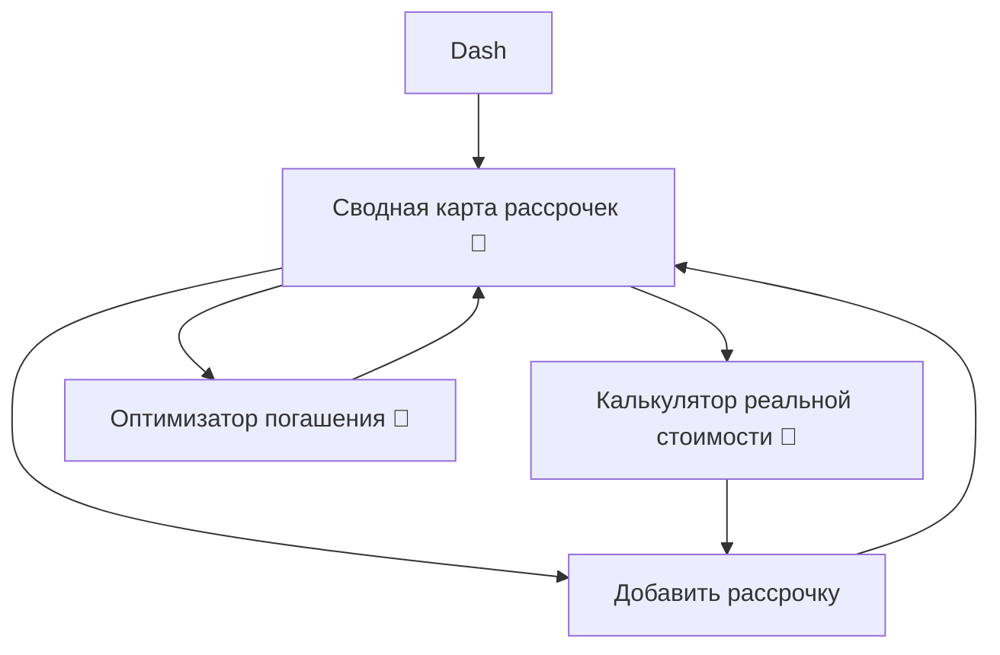

---

## 9. Семейный / общий бюджет (💎)

### Экран 9.1 — Приглашение участника 💎
- **Элементы:** генерация ссылки/QR-кода приглашения, ввод номера телефона партнёра, выбор роли (полный доступ / только просмотр общих категорий).
- **Переход:** экран ожидания принятия приглашения.

### Экран 9.2 — Общий бюджет 💎
- **Элементы:** переключатель "Общее" / "Моё личное", общие категории (аренда, продукты, дети) видны обоим участникам, личные "конверты" видны только владельцу.
- **Переход:** детали категории, приглашение ещё одного участника.

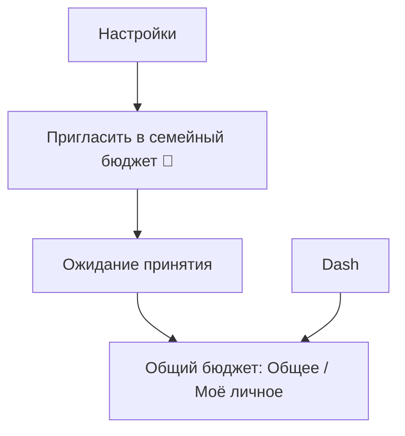

---

## 10. AI-ассистент 🤖

Это финальная и центральная точка пути пользователя — куда ведут все проактивные сигналы приложения.

### Точки входа в AI
1. Карточка "AI-инсайт дня" на Dashboard (5.1)
2. Иконка "AI" в нижней навигации
3. Push-уведомление ("Вы близки к лимиту по категории Еда") → deep link прямо в чат с контекстом
4. Кнопка "Спросить AI" на экранах отчётов и трекера рассрочек

### Экран 10.1 — Чат с AI-ассистентом 💎 🤖
- **Назначение:** разговорный интерфейс — пользователь задаёт вопросы о своих финансах на русском/казахском, получает ответы с учётом истории транзакций.
- **Элементы:** лента сообщений (пользователь/AI), поле ввода текста, кнопка микрофона для голосового вопроса, предложенные быстрые вопросы-чипы ("Сколько я потратил на такси в этом месяце?", "Как сократить траты на рассрочки?").
- **Действие:** ввод вопроса текстом или голосом.
- **Переход:** ответ отображается в чате; если ответ ссылается на конкретную транзакцию/бюджет — тап ведёт на соответствующий экран.

### Экран 10.2 — Проактивные AI-инсайты (лента) 🤖 💎 (частично 🆓 — базовые уведомления)
- **Назначение:** отдельная лента накопленных инсайтов (не только чат "по запросу", но и то, что AI заметил сам): обнаруженные подписки, рост цен у мерчанта, риск кассового разрыва, прогноз по цели накопления.
- **Элементы:** карточки инсайтов с иконкой типа (⚠️ риск, 💡 совет, 📈 тренд), кнопка "Обсудить с AI" — открывает чат с предзаполненным контекстом.
- **Переход:** чат (10.1) или напрямую на связанный экран (бюджет/рассрочка/цель).

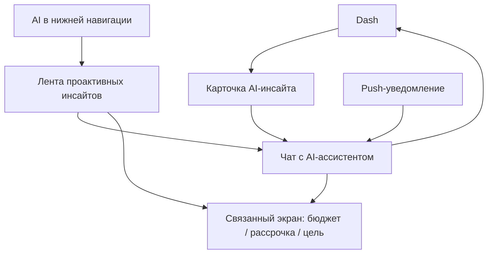

### Технический поток одного запроса к AI (sequence diagram)

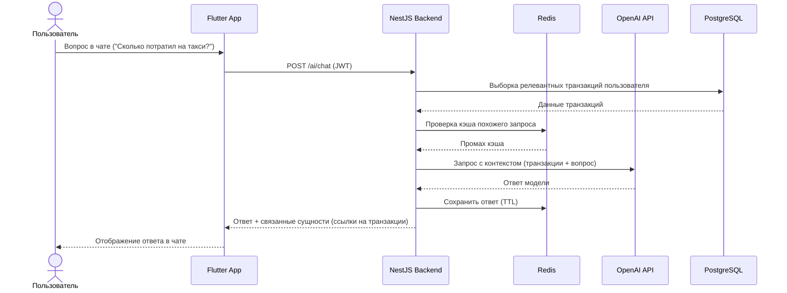

---

## 11. Отчёты и аналитика

### Экран 11.1 — Обзор отчётов 🆓 (базовые) / 💎 (расширенные)
- **Элементы:** переключатель периода, круговая диаграмма по категориям 🆓, heat map трат по дням 💎, тренды по категориям во времени 💎, кнопка экспорта в PDF/Excel 💎.
- **Переход:** детали по категории, экспорт, "Обсудить с AI".

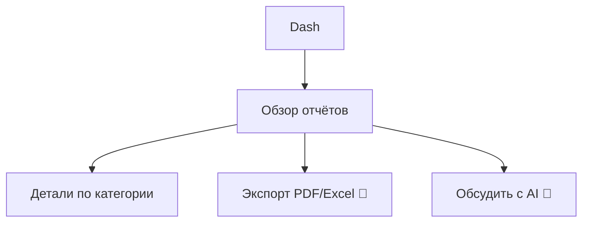

---

## 12. Настройки и переход на Premium

### Экран 12.1 — Настройки 🆓
- **Элементы:** профиль, язык, валюта по умолчанию, управление счетами/кошельками, семейный доступ, уведомления, безопасность (biometric lock), раздел "Premium" с текущим статусом, поддержка, выход.
- **Переход:** Paywall, если тариф Free.

### Экран 12.2 — Paywall (экран перехода на Premium) 💎
- **Назначение:** появляется как из настроек, так и контекстно в момент упора в лимит Free-тарифа (лимит OCR, попытка второй цели, попытка семейного доступа и т.д.).
- **Элементы:** сравнение Free/Premium (таблица возможностей из PRD раздел 7), тарифы (месяц/год), способы оплаты — **Kaspi Pay** как основной локальный способ, Apple Pay/Google Pay как альтернатива, кнопка "Оформить".
- **Действие:** выбор тарифа и способа оплаты.
- **Переход:** экран оплаты провайдера → подтверждение → возврат на экран, с которого был вызван paywall, уже в разблокированном виде.

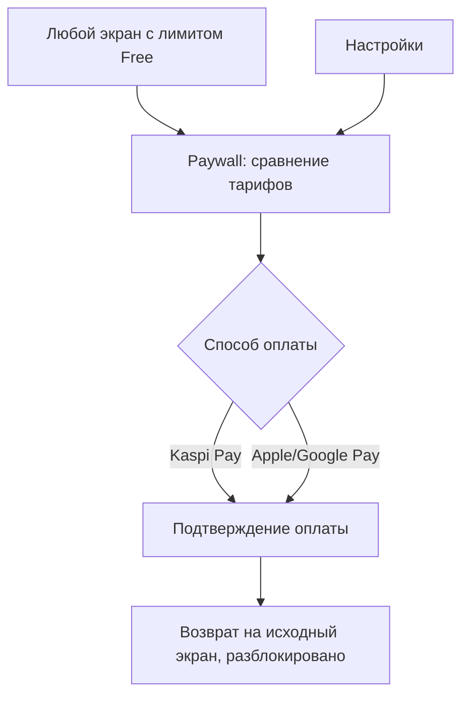

---

## Итоговая сводка: полный путь новой персоны (пример — Молодая семья, персона 2)

1. Открывает приложение впервые → Splash → выбор языка RU
2. Смотрит value-экраны, впечатляет "Рассрочки под контролем" (у семьи их несколько)
3. Регистрируется по телефону, подтверждает SMS-код
4. Выбирает валюту KZT, цель — "Вести бюджет с семьёй"
5. Пропускает импорт банка, решает начать с ручного ввода
6. На Dashboard добавляет первую транзакцию через фото чека из супермаркета
7. Создаёт бюджет "Продукты" и цель "Отпуск летом"
8. Через неделю получает push: "Вы приближаетесь к лимиту по категории Продукты" → тап открывает чат с AI
9. Спрашивает AI: "Как сократить траты на продукты?" — получает персонализированный совет
10. Приглашает партнёра в семейный бюджет → упирается в лимит Free → видит Paywall → оформляет Premium через Kaspi Pay
11. Дальше регулярно использует Dashboard + AI-инсайты + общий бюджет с партнёром — становится retained-пользователем.

Этот сценарий должен использоваться как основа для прототипирования в Figma (UI Designer) и для написания E2E-тестов (QA Engineer).
