# Architecture: AI Finance

**Версия:** 0.1 (черновик для обсуждения)
**Автор:** Principal Architect
**Дата:** 2026-07-16
**Статус:** на согласование
**Связанные документы:** [01_PRD.md](01_PRD.md), [02_Market_Research.md](02_Market_Research.md), [04_User_Flows.md](04_User_Flows.md), [05_UX.md](05_UX.md)

> Документ описывает целевую архитектуру системы. Это не код и не готовые к вставке сниппеты — это структура, границы модулей, потоки данных и контракты между компонентами для дальнейшей детальной реализации Flutter/NestJS-командами.

---

## 0. Архитектурные принципы

Согласно CLAUDE.md, обязательны: **Clean Architecture, Feature First, SOLID, DDD, Repository Pattern**. Это выражается так:

- **Clean Architecture** — зависимости всегда направлены внутрь (Presentation → Application → Domain ← Infrastructure), домен не знает о фреймворках, БД или внешних API.
- **DDD** — система разбита на **bounded contexts** (Идентичность, Учёт транзакций, Планирование, Кредиты/рассрочки, Инвестиции, AI, Платежи, Уведомления, Синхронизация), каждый со своим языком и моделью данных; между контекстами — явные контракты (события/интерфейсы), не общие таблицы "на всё".
- **Feature First** — и бэкенд (NestJS-модули), и фронтенд (Flutter feature-модули) организованы по фиче/bounded context, а не по техническому слою ("все контроллеры", "все виджеты").
- **Repository Pattern** — домен обращается к данным только через интерфейсы репозиториев; TypeORM/Prisma и Drift/Hive — детали инфраструктуры, скрытые за интерфейсом.
- **SOLID** — в первую очередь Dependency Inversion (домен зависит от абстракций) и Single Responsibility (use case = одна бизнес-операция).

---

## 1. Высокоуровневая архитектура системы

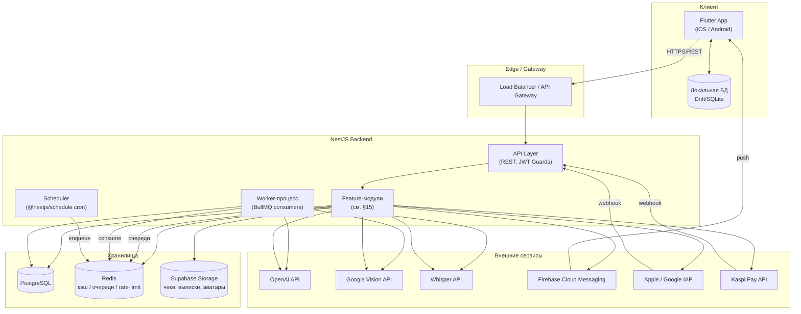

**Ключевое архитектурное решение:** API-процесс и Worker-процесс — это **один и тот же кодовый модуль NestJS, но два разных runtime-процесса** (разные Docker-контейнеры, см. §9), запускаемые с разными entrypoint. Это позволяет масштабировать приём HTTP-запросов и обработку тяжёлых фоновых задач (OCR, AI-инсайты) независимо друг от друга.

---

## 2. Backend (NestJS)

### Слоистая структура одного модуля (Clean Architecture)

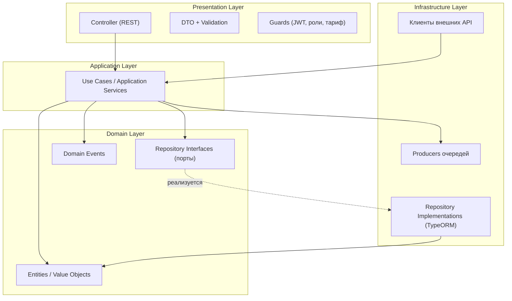

**Правило зависимостей:** `RepoIface` определён в Domain-слое, `RepoImpl` — в Infrastructure и внедряется через DI-контейнер Nest (Dependency Inversion). Use Case никогда не импортирует TypeORM/HTTP-клиенты напрямую.

### Межмодульное взаимодействие

Модули общаются друг с другом **только** через: (а) явно экспортированные Application-сервисы, (б) доменные события (`EventEmitter2` / внутренняя шина) — например, `TransactionCreatedEvent` слушают модули Budgets (проверка лимита), AI (обновление контекста), RecurringPayments (детекция паттернов). Прямые импорты репозиториев чужого модуля запрещены — это граница bounded context из DDD.

---

## 3. Frontend (Flutter)

### Слоистая структура (Feature First + Clean Architecture + Riverpod)

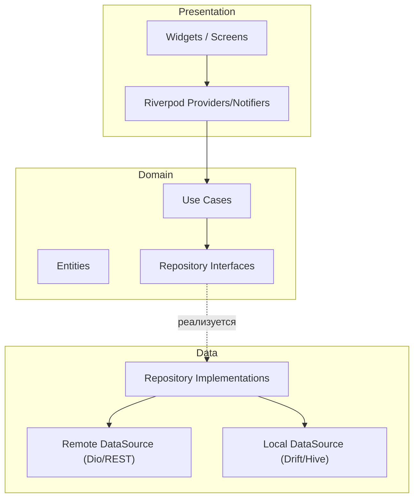

- Каждая фича (`wallet`, `transactions`, `goals`, `ai_chat`, …) — отдельный пакет/директория с одинаковой внутренней структурой `presentation / domain / data`.
- `core`/`shared` — общий пакет: сетевой клиент, локальная БД, дизайн-система (из [05_UX.md](05_UX.md)), обработка ошибок, offline-sync движок (§8).
- **Repository-реализация сама решает**, обращаться ли к `RemoteDS` или `LocalDS` — presentation-слой и use cases не знают, онлайн приложение сейчас или офлайн (см. §8).

---

## 4. AI

### Компоненты

| Компонент | Назначение |
|---|---|
| **AI Gateway** (модуль `AiModule`) | Единая точка входа: `/ai/chat`, `/ai/categorize`, `/ai/insights` |
| **Context Builder** | Собирает релевантный контекст пользователя (транзакции, бюджеты, цели) из репозиториев других модулей через явные Application-сервисы |
| **Prompt Registry** | Версионированные шаблоны промптов на задачу (категоризация / чат / генерация инсайтов / разбор чека / разбор голоса) |
| **OpenAI Client Wrapper** | Ретраи, таймауты, подсчёт токенов/стоимости, логирование |
| **Response Cache (Redis)** | Кэш категоризации по хэшу `merchant+amount` — одинаковые операции не уходят в OpenAI повторно |
| **Guardrails** | Маскирование чувствительных данных перед отправкой во внешний API, модерация вывода |
| **Insight Generator (фоновая задача)** | Ночной анализ транзакций каждого пользователя → проактивные инсайты → уведомления |

### Поток запроса (синхронный, AI Chat)

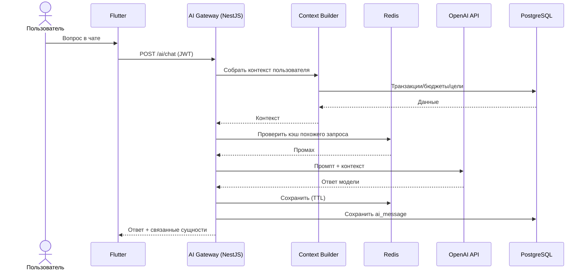

### Асинхронный поток (проактивные инсайты)

Ежедневный cron (§13) ставит по одной задаче в очередь `ai-insight-generation` на активного пользователя → Worker собирает контекст → вызывает OpenAI → сохраняет инсайт → передаёт в `NotificationsModule` (§7).

---

## 5. OCR (распознавание чеков)

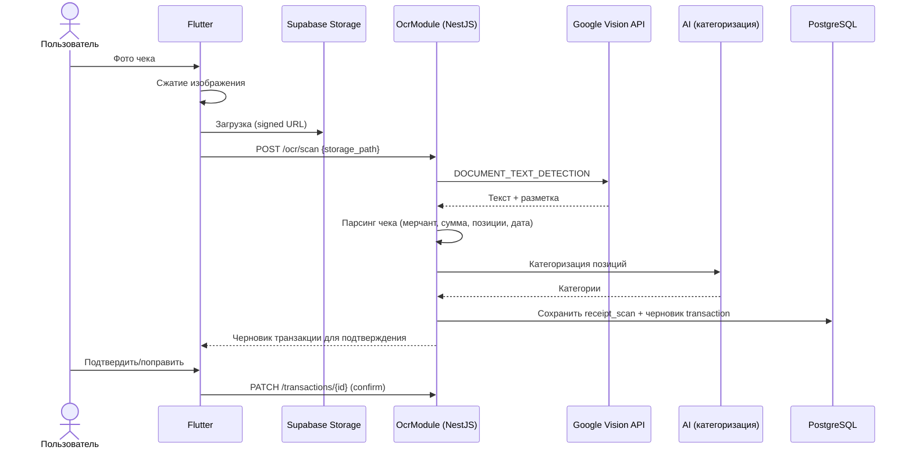

**Решение по производительности:** обработка идёт синхронно в API-процессе с таймаутом (цель — ответ пользователю за 2–3 секунды). Если Vision API отвечает дольше порога (5 сек) — запрос переставляется в очередь `ocr-processing` (Worker), а клиенту возвращается статус "обрабатывается" с последующим push-уведомлением о готовности.

---

## 6. Voice (голосовой ввод)

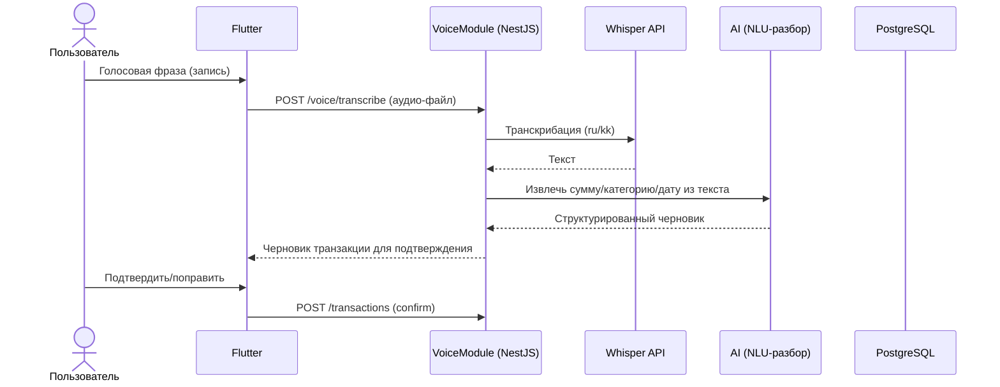

Голос и OCR используют один и тот же общий downstream-шаг — **черновик транзакции требует явного подтверждения пользователя**, автосохранение без подтверждения запрещено (см. [05_UX.md](05_UX.md), AI Chat/принципы).

---

## 7. Payments (Apple / Google / Kaspi Pay)

### Компоненты

- **Client-side:** `in_app_purchase` (Apple/Google) для международных пользователей; Kaspi Pay SDK/redirect-flow для локальной оплаты (основной канал, см. [02_Market_Research.md](02_Market_Research.md))
- **PaymentsModule (backend):** валидация чеков покупки (App Store Server API / Google Play Developer API), обработка вебхуков (App Store Server Notifications V2, Google RTDN, Kaspi Pay callback), единая сущность `premium_subscription` как источник истины
- **Entitlement Service:** остальные модули (AI, OCR, Goals, Investments) проверяют доступ через общий Guard/Interceptor, обращающийся к Entitlement Service — не к сырой таблице подписки напрямую

### Жизненный цикл Premium-подписки

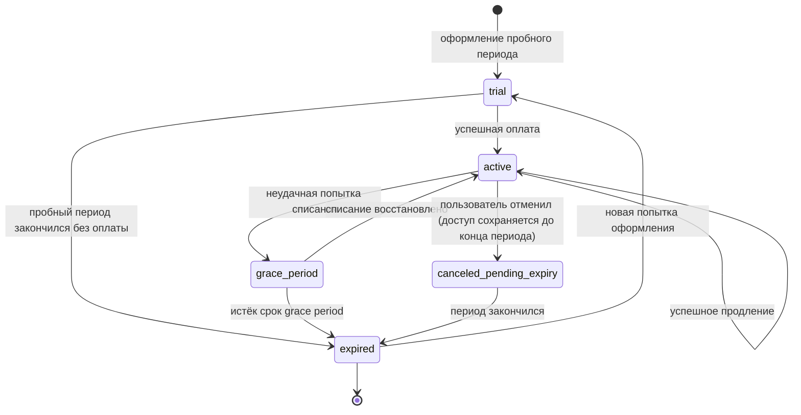

### Поток оплаты (пример Kaspi Pay)

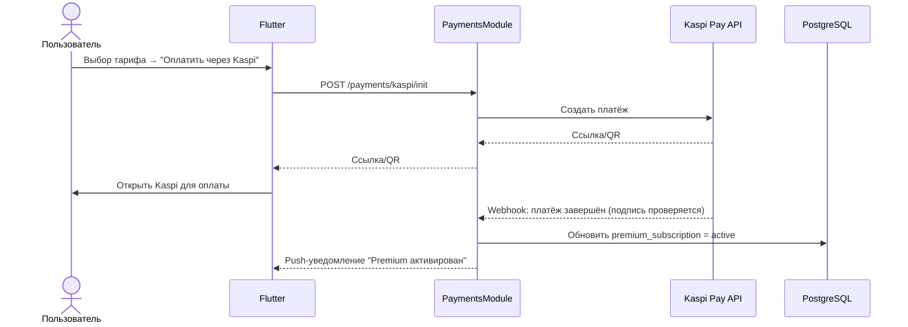

---

## 8. Notifications

### Триггеры и каналы

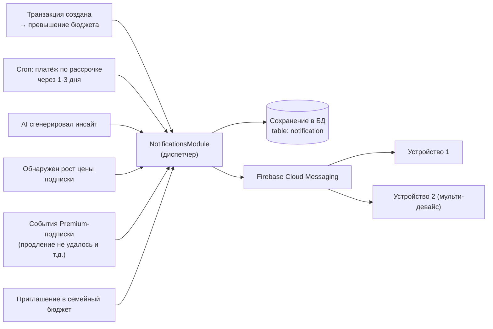

- Каждое устройство регистрирует FCM-токен в таблице `device` — фан-аут на все активные устройства пользователя.
- **In-app центр уведомлений всегда обновляется** (запись в `notification`), push — best-effort канал поверх него; это гарантирует, что уведомление не теряется офлайн (см. §8/Offline).

---

## 9. Offline Sync

### Принцип

Локальная БД (Drift/SQLite) на устройстве — не просто кэш, а **полноценная рабочая копия** ключевых сущностей (счета, транзакции, категории, бюджеты, цели, рассрочки). Запись всегда идёт сначала локально (optimistic), затем — в очередь синхронизации (Outbox pattern).

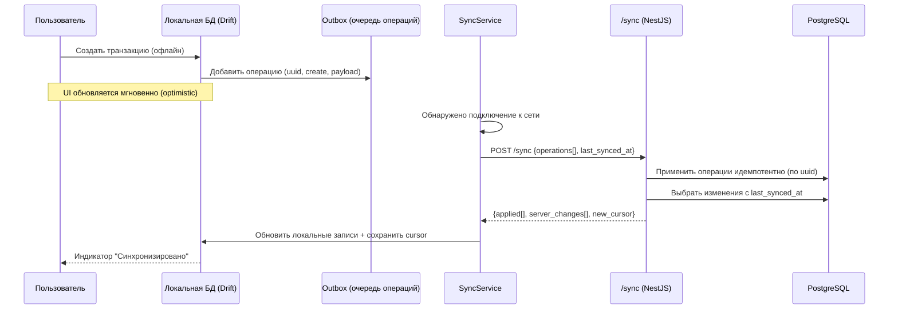

### Правила разрешения конфликтов

| Тип сущности | Стратегия |
|---|---|
| Транзакции | Append-only — конфликтов почти нет; при редактировании — приоритет за сервером (server wins), клиент получает актуальную версию |
| Бюджеты / Цели / Рассрочки | Last-write-wins по `updated_at`, сравнение на сервере |
| Баланс счёта | Никогда не считается на клиенте авторитетно — всегда пересчитывается сервером из истории транзакций |
| Удаления | Soft-delete с полем `deleted_at`, реплицируется как обычное изменение |

Курсор синхронизации (`last_synced_at` + монотонный `id`) хранится и на клиенте, и как часть ответа сервера — pull-модель "дай мне всё, что изменилось после X", без необходимости серверу хранить очередь на каждого клиента.

---

## 10. Docker

### Dev-окружение (docker-compose)

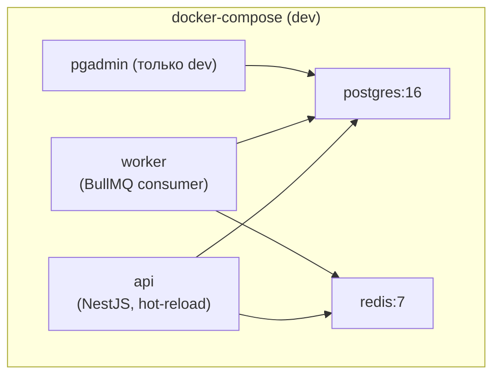

### Прод-окружение (концептуально)

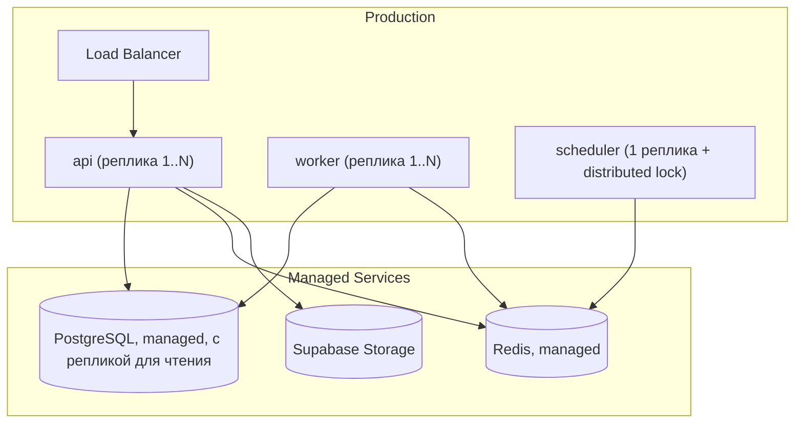

**Важно:** `api`, `worker` и `scheduler` — три разных Docker-образа сборки из одной кодовой базы (разные `main.ts`/entrypoint), масштабируются независимо. `scheduler` всегда одна реплика (или с distributed lock через Redis) — иначе cron-задачи задублируются.

---

## 11. CI/CD (GitHub Actions)

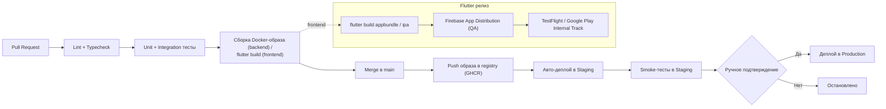

- Миграции БД — отдельный контролируемый шаг перед деплоем в production, с ручным подтверждением (никогда не выполняются автоматически при старте контейнера).
- Правило CLAUDE.md "каждая задача — максимум один рабочий день" отражено в CI: пайплайн заточен на частые маленькие PR, а не редкие большие релизы.

---

## 12. Background Jobs (cron / плановые задачи)

| Задача | Расписание | Что делает |
|---|---|---|
| `installment-reminder` | ежедневно | Проверяет `installment_payment` со сроком через 1–3 дня, создаёт уведомления |
| `ai-insight-generation` | ежедневно (ночью) | Для каждого активного пользователя ставит задачу в очередь `ai-insight-generation` |
| `recurring-payment-detection` | еженедельно | Анализирует историю транзакций на паттерны регулярных платежей (Subscriptions, [05_UX.md §10](05_UX.md#10-subscriptions-подписки-и-регулярные-платежи)) |
| `exchange-rate-refresh` | каждые 4 часа | Обновляет курсы валют в таблице `exchange_rate` |
| `subscription-renewal-check` | каждые 6 часов | Сверяет статусы Premium-подписок с провайдерами, ловит "тихие" истечения |
| `data-retention-cleanup` | еженедельно | Удаляет "мягко" удалённые записи старше N дней, чистит неактивные `receipt_scan` файлы |

Каждая cron-задача **не выполняет тяжёлую работу сама**, а ставит по одной задаче в соответствующую очередь на пользователя/сущность — это разделение ответственности "когда запускать" (Scheduler) от "как обрабатывать с ретраями" (Queue/Worker).

---

## 13. Очереди (BullMQ поверх Redis)

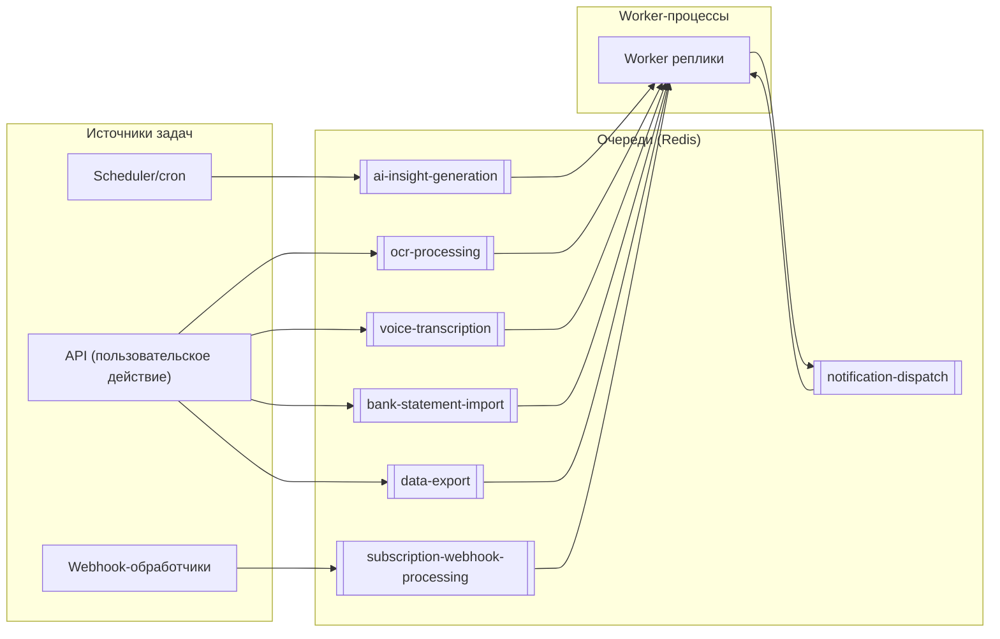

| Очередь | Конкурентность | Retry-политика | Примечание |
|---|---|---|---|
| `ocr-processing` | средняя | 3 попытки, экспоненциальный backoff | Fallback при таймауте Google Vision |
| `voice-transcription` | средняя | 3 попытки | Fallback при таймауте Whisper |
| `ai-insight-generation` | низкая (rate-limit к OpenAI) | 2 попытки | Одна задача = один пользователь |
| `notification-dispatch` | высокая | 5 попыток | Идемпотентна по design (fan-out на устройства) |
| `bank-statement-import` | низкая (тяжёлые файлы) | 2 попытки | Большие PDF/CSV, может занимать минуты |
| `subscription-webhook-processing` | высокая | 5 попыток с backoff | Критично не терять платёжные события |
| `data-export` | низкая | 2 попытки | Генерация PDF/Excel по запросу Premium |

---

## 14. Database (PostgreSQL)

Схема организована по bounded contexts из §0 — каждый контекст владеет своими таблицами, чужие читает только через Application-сервисы соответствующего модуля (не через прямые SQL JOIN между "чужими" таблицами в коде другого модуля).

## ER Diagram

```mermaid
erDiagram
    USER ||--o{ ACCOUNT : owns
    USER ||--o{ CATEGORY : "создаёт (кастомные)"
    USER ||--o{ BUDGET : sets
    USER ||--o{ GOAL : sets
    USER ||--o{ INSTALLMENT : has
    USER ||--o{ ASSET : owns
    USER ||--o{ RECEIPT_SCAN : uploads
    USER ||--o{ AI_CONVERSATION : starts
    USER ||--o{ RECURRING_PAYMENT : has
    USER ||--o{ NOTIFICATION : receives
    USER ||--o{ DEVICE : registers
    USER ||--|| PREMIUM_SUBSCRIPTION : has
    USER ||--o{ FAMILY_GROUP : owns
    FAMILY_GROUP ||--o{ FAMILY_MEMBER : includes
    FAMILY_MEMBER }o--|| USER : "ссылается на"
    ACCOUNT ||--o{ TRANSACTION : contains
    CATEGORY ||--o{ TRANSACTION : classifies
    CATEGORY ||--o{ BUDGET : "ограничивает"
    GOAL ||--o{ GOAL_CONTRIBUTION : "пополняется"
    GOAL }o--o| USER : "со-владелец (опционально)"
    INSTALLMENT ||--o{ INSTALLMENT_PAYMENT : "график платежей"
    RECEIPT_SCAN ||--o| TRANSACTION : "создаёт черновик"
    AI_CONVERSATION ||--o{ AI_MESSAGE : contains

    USER {
        uuid id PK
        string phone
        string email
        string name
        string locale
        string default_currency
        timestamp created_at
    }
    ACCOUNT {
        uuid id PK
        uuid user_id FK
        string type "cash/bank/card/multi_currency"
        string name
        string currency
        decimal balance_cached
        string provider
        boolean archived
    }
    TRANSACTION {
        uuid id PK
        uuid account_id FK
        uuid category_id FK
        decimal amount
        string currency
        string type "income/expense"
        date occurred_at
        string note
        string source "manual/ocr/voice/import"
        uuid receipt_scan_id FK
        timestamp created_at
        timestamp deleted_at
    }
    CATEGORY {
        uuid id PK
        uuid user_id FK "nullable, null = системная"
        string name
        string icon
        uuid parent_id FK
    }
    BUDGET {
        uuid id PK
        uuid user_id FK
        uuid category_id FK
        decimal amount_limit
        string period "weekly/monthly"
        date start_date
    }
    GOAL {
        uuid id PK
        uuid user_id FK
        string name
        decimal target_amount
        string currency
        date target_date
        decimal current_amount
        uuid co_owner_user_id FK
    }
    GOAL_CONTRIBUTION {
        uuid id PK
        uuid goal_id FK
        decimal amount
        date contributed_at
    }
    INSTALLMENT {
        uuid id PK
        uuid user_id FK
        string merchant
        decimal total_amount
        int installments_count
        date start_date
        string provider
    }
    INSTALLMENT_PAYMENT {
        uuid id PK
        uuid installment_id FK
        date due_date
        decimal amount
        string status "pending/paid/overdue"
    }
    ASSET {
        uuid id PK
        uuid user_id FK
        string type "deposit/real_estate/stock/crypto/gold"
        string name
        decimal value
        string currency
        timestamp updated_at
    }
    FAMILY_GROUP {
        uuid id PK
        uuid owner_user_id FK
        string name
    }
    FAMILY_MEMBER {
        uuid id PK
        uuid family_group_id FK
        uuid user_id FK
        string role "full/view"
    }
    RECEIPT_SCAN {
        uuid id PK
        uuid user_id FK
        string image_url
        jsonb raw_ocr_json
        string status
        timestamp created_at
    }
    AI_CONVERSATION {
        uuid id PK
        uuid user_id FK
        timestamp started_at
    }
    AI_MESSAGE {
        uuid id PK
        uuid conversation_id FK
        string role "user/assistant"
        text content
        timestamp created_at
    }
    RECURRING_PAYMENT {
        uuid id PK
        uuid user_id FK
        string merchant
        decimal amount
        string periodicity
        date next_charge_date
        timestamp detected_at
    }
    NOTIFICATION {
        uuid id PK
        uuid user_id FK
        string type
        jsonb payload
        timestamp sent_at
        timestamp read_at
    }
    DEVICE {
        uuid id PK
        uuid user_id FK
        string fcm_token
        string platform
        timestamp last_active_at
    }
    PREMIUM_SUBSCRIPTION {
        uuid id PK
        uuid user_id FK
        string plan
        string status
        string provider "apple/google/kaspi"
        timestamp started_at
        timestamp renews_at
        timestamp expires_at
    }
    EXCHANGE_RATE {
        uuid id PK
        string base_currency
        string quote_currency
        decimal rate
        date rate_date
    }
```

---

## 15. Redis

| Назначение | Ключевой паттерн | TTL/политика |
|---|---|---|
| Кэш AI-категоризации | `ai:categorize:{hash(merchant+amount)}` | TTL 30 дней |
| Кэш курсов валют | `fx:{base}:{quote}` | TTL 4 часа |
| Backend очередей (BullMQ) | внутренние структуры BullMQ | — |
| Rate limiting (AI Chat Free-тариф, попытки OTP) | sliding window счётчики | TTL по окну (например, 1 день) |
| Denylist отозванных refresh-токенов | `auth:denylist:{jti}` | TTL = остаток срока жизни токена |
| Distributed lock для cron | `lock:job:{name}` | TTL = ожидаемая длительность задачи |
| Pub/Sub для real-time обновления открытых сессий (мульти-девайс) | канал `user:{id}:updates` | — |

---

## 16. Модули

### Backend (NestJS) — по bounded context

| Модуль | Ответственность | Внешние зависимости |
|---|---|---|
| `AuthModule` | Регистрация/вход, OTP, JWT + Refresh Token | — |
| `UsersModule` | Профиль, локаль, настройки | — |
| `AccountsModule` | Кошельки/счета, мультивалютность | — |
| `TransactionsModule` | Транзакции, авто-категоризация | AiModule |
| `CategoriesModule` | Категории системные/кастомные | — |
| `BudgetsModule` | Бюджеты, проверка лимитов | TransactionsModule (события) |
| `GoalsModule` | Цели накоплений, со-владение | AccountsModule |
| `InstallmentsModule` | Рассрочки/BNPL, календарь платежей | NotificationsModule |
| `InvestmentsModule` | Активы, Net Worth | ExchangeRateService |
| `RecurringPaymentsModule` | Детекция подписок | AiModule, TransactionsModule |
| `FamilyModule` | Семейный доступ, роли | UsersModule |
| `AiModule` | Чат, категоризация, инсайты | OpenAI |
| `OcrModule` | Разбор чеков | Google Vision, Supabase Storage |
| `VoiceModule` | Разбор голосового ввода | Whisper |
| `NotificationsModule` | Push + in-app центр уведомлений | Firebase |
| `PaymentsModule` | Premium-подписка, вебхуки | Apple/Google/Kaspi |
| `SyncModule` | Offline-синхронизация | все feature-модули (только чтение через сервисы) |
| `ReportsModule` | Агрегация статистики | TransactionsModule |
| `SharedKernel` | Currency/ExchangeRate service, аудит-лог, общие Value Objects | — |

### Frontend (Flutter) — feature-модули

`auth`, `onboarding`, `dashboard`, `wallet`, `transactions`, `statistics`, `ai_chat`, `goals`, `investments`, `subscriptions`, `installments`, `family`, `settings`, `sync` (offline-движок), `core`/`shared` (дизайн-система, сетевой клиент, локальная БД).

Каждый Flutter feature-модуль соответствует ровно одному backend-модулю или их небольшой группе — сохраняется единая ментальная модель между командами.

---

## 17. Следующие шаги

1. AI Engineer — детализировать промпт-шаблоны и политику эскалации при недоступности OpenAI (fallback на правило-based категоризацию).
2. NestJS-команда — оценить трудозатраты по каждому модулю из §16 в рабочих днях (правило CLAUDE.md: максимум 1 день на задачу) и составить бэклог.
3. Flutter-команда — спроектировать схему локальной БД (Drift) для §9 (Offline Sync) на основе ER-диаграммы §14.
4. DevOps Engineer — поднять dev docker-compose (§10) и базовый GitHub Actions пайплайн (§11) как первую инфраструктурную задачу.
