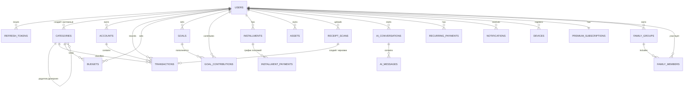

# Database Design: AI Finance (PostgreSQL)

**Версия:** 0.1 (черновик для обсуждения)
**Автор:** Principal Architect
**Дата:** 2026-07-16
**Статус:** на согласование
**Связанные документы:** [06_Architecture.md](06_Architecture.md)

> Полная физическая схема PostgreSQL: таблицы, связи, индексы, ограничения — детализация ER-диаграммы из [06_Architecture.md §14](06_Architecture.md#14-database-postgresql). SQL ниже — канонический источник правды для будущих ORM-миграций (TypeORM/Prisma), а не сам механизм миграций.

---

## 1. Конвенции схемы

| Конвенция | Решение |
|---|---|
| Имена таблиц | множественное число, `snake_case` |
| Первичный ключ | `id UUID DEFAULT gen_random_uuid()` — везде, чтобы ID можно было генерировать на клиенте офлайн (важно для [Offline Sync](06_Architecture.md#9-offline-sync)) |
| Денежные суммы | `NUMERIC(18,2)`, всегда неотрицательные (знак операции задаёт поле `type`, не отрицательное число) |
| Валюта | `CHAR(3)` (ISO 4217), без отдельной таблицы справочника валют — валидируется на уровне приложения и `CHECK` |
| Время | `TIMESTAMPTZ`, всегда UTC на уровне БД |
| Мягкое удаление | `deleted_at TIMESTAMPTZ NULL` — на таблицах, где пользователь может "удалить" сущность, применяется вместо `DELETE` (согласовано с [Offline Sync §9](06_Architecture.md#9-offline-sync)) |
| Аудит | `created_at` везде; `updated_at` — везде, где возможно изменение, поддерживается триггером (см. §3) |
| Бизнес-логика | Пересчёт баланса, лимитов и т.п. **не** делается триггерами БД — считается в Application-слое (Clean Architecture: домен не прячется в БД) |

---

## 2. Расширения

```sql
CREATE EXTENSION IF NOT EXISTS pgcrypto; -- gen_random_uuid()
```

---

## 3. Общая функция для `updated_at`

```sql
CREATE OR REPLACE FUNCTION set_updated_at()
RETURNS TRIGGER AS $$
BEGIN
    NEW.updated_at = now();
    RETURN NEW;
END;
$$ LANGUAGE plpgsql;
```

Триггер `BEFORE UPDATE ... EXECUTE FUNCTION set_updated_at()` навешивается на каждую таблицу, где есть `updated_at` (перечислены в §9 в конце каждого блока `CREATE TRIGGER`).

---

## 4. ENUM-типы

```sql
CREATE TYPE account_type AS ENUM ('cash', 'bank', 'card', 'multi_currency');
CREATE TYPE transaction_type AS ENUM ('income', 'expense');
CREATE TYPE transaction_source AS ENUM ('manual', 'ocr', 'voice', 'import');
CREATE TYPE budget_period AS ENUM ('weekly', 'monthly');
CREATE TYPE installment_payment_status AS ENUM ('pending', 'paid', 'overdue');
CREATE TYPE asset_type AS ENUM ('deposit', 'real_estate', 'stock', 'crypto', 'gold', 'other');
CREATE TYPE family_role AS ENUM ('full', 'view');
CREATE TYPE ai_message_role AS ENUM ('user', 'assistant', 'system');
CREATE TYPE device_platform AS ENUM ('ios', 'android');
CREATE TYPE payment_provider AS ENUM ('apple', 'google', 'kaspi');
CREATE TYPE premium_status AS ENUM ('trial', 'active', 'grace_period', 'canceled_pending_expiry', 'expired');
CREATE TYPE recurring_periodicity AS ENUM ('weekly', 'monthly', 'quarterly', 'yearly');
```

---

## 5. Таблицы

### 5.1 `users`

```sql
CREATE TABLE users (
    id                  UUID PRIMARY KEY DEFAULT gen_random_uuid(),
    phone               VARCHAR(20) UNIQUE,
    email               VARCHAR(255) UNIQUE,
    name                VARCHAR(100),
    locale              VARCHAR(5) NOT NULL DEFAULT 'ru',
    default_currency    CHAR(3) NOT NULL DEFAULT 'KZT',
    created_at          TIMESTAMPTZ NOT NULL DEFAULT now(),
    updated_at          TIMESTAMPTZ NOT NULL DEFAULT now(),
    deleted_at          TIMESTAMPTZ,

    CONSTRAINT chk_users_phone_format CHECK (phone IS NULL OR phone ~ '^\+[1-9][0-9]{7,14}$'),
    CONSTRAINT chk_users_email_format CHECK (email IS NULL OR email ~ '^[^@\s]+@[^@\s]+\.[^@\s]+$'),
    CONSTRAINT chk_users_has_identifier CHECK (phone IS NOT NULL OR email IS NOT NULL),
    CONSTRAINT chk_users_locale CHECK (locale IN ('ru', 'kk', 'en'))
);

CREATE UNIQUE INDEX ux_users_phone ON users (phone) WHERE deleted_at IS NULL;
CREATE UNIQUE INDEX ux_users_email ON users (lower(email)) WHERE deleted_at IS NULL AND email IS NOT NULL;

CREATE TRIGGER trg_users_updated_at BEFORE UPDATE ON users
    FOR EACH ROW EXECUTE FUNCTION set_updated_at();
```

### 5.2 `refresh_tokens`

```sql
CREATE TABLE refresh_tokens (
    id              UUID PRIMARY KEY DEFAULT gen_random_uuid(),
    user_id         UUID NOT NULL REFERENCES users(id) ON DELETE CASCADE,
    token_hash      VARCHAR(255) NOT NULL,
    device_id       UUID,
    issued_at       TIMESTAMPTZ NOT NULL DEFAULT now(),
    expires_at      TIMESTAMPTZ NOT NULL,
    revoked_at      TIMESTAMPTZ,

    CONSTRAINT uq_refresh_tokens_hash UNIQUE (token_hash),
    CONSTRAINT chk_refresh_tokens_expiry CHECK (expires_at > issued_at)
);

CREATE INDEX ix_refresh_tokens_user_id ON refresh_tokens (user_id);
CREATE INDEX ix_refresh_tokens_expires_at ON refresh_tokens (expires_at) WHERE revoked_at IS NULL;
```

### 5.3 `otp_codes`

```sql
CREATE TABLE otp_codes (
    id              UUID PRIMARY KEY DEFAULT gen_random_uuid(),
    identifier      VARCHAR(255) NOT NULL, -- телефон или email
    code_hash       VARCHAR(255) NOT NULL,
    attempts        SMALLINT NOT NULL DEFAULT 0,
    created_at      TIMESTAMPTZ NOT NULL DEFAULT now(),
    expires_at      TIMESTAMPTZ NOT NULL,
    used_at         TIMESTAMPTZ,

    CONSTRAINT chk_otp_attempts CHECK (attempts >= 0 AND attempts <= 5)
);

CREATE INDEX ix_otp_codes_identifier ON otp_codes (identifier, expires_at DESC);
```

### 5.4 `categories`

```sql
CREATE TABLE categories (
    id          UUID PRIMARY KEY DEFAULT gen_random_uuid(),
    user_id     UUID REFERENCES users(id) ON DELETE CASCADE, -- NULL = системная категория
    parent_id   UUID REFERENCES categories(id) ON DELETE SET NULL,
    name        VARCHAR(100) NOT NULL,
    icon        VARCHAR(50) NOT NULL,
    created_at  TIMESTAMPTZ NOT NULL DEFAULT now(),
    deleted_at  TIMESTAMPTZ
);

-- Системные категории уникальны по имени; пользовательские — уникальны в рамках пользователя
CREATE UNIQUE INDEX ux_categories_system_name ON categories (name) WHERE user_id IS NULL AND deleted_at IS NULL;
CREATE UNIQUE INDEX ux_categories_user_name ON categories (user_id, name) WHERE user_id IS NOT NULL AND deleted_at IS NULL;
CREATE INDEX ix_categories_parent_id ON categories (parent_id);
```

### 5.5 `accounts`

```sql
CREATE TABLE accounts (
    id              UUID PRIMARY KEY DEFAULT gen_random_uuid(),
    user_id         UUID NOT NULL REFERENCES users(id) ON DELETE CASCADE,
    type            account_type NOT NULL,
    name            VARCHAR(100) NOT NULL,
    currency        CHAR(3) NOT NULL,
    balance_cached  NUMERIC(18,2) NOT NULL DEFAULT 0,
    provider        VARCHAR(100),
    archived        BOOLEAN NOT NULL DEFAULT false,
    created_at      TIMESTAMPTZ NOT NULL DEFAULT now(),
    updated_at      TIMESTAMPTZ NOT NULL DEFAULT now(),
    deleted_at      TIMESTAMPTZ,

    CONSTRAINT chk_accounts_currency CHECK (currency ~ '^[A-Z]{3}$')
);

CREATE INDEX ix_accounts_user_id ON accounts (user_id) WHERE deleted_at IS NULL;

CREATE TRIGGER trg_accounts_updated_at BEFORE UPDATE ON accounts
    FOR EACH ROW EXECUTE FUNCTION set_updated_at();
```

### 5.6 `receipt_scans`

```sql
CREATE TABLE receipt_scans (
    id              UUID PRIMARY KEY DEFAULT gen_random_uuid(),
    user_id         UUID NOT NULL REFERENCES users(id) ON DELETE CASCADE,
    image_url       TEXT NOT NULL,
    raw_ocr_json    JSONB,
    status          VARCHAR(20) NOT NULL DEFAULT 'pending',
    created_at      TIMESTAMPTZ NOT NULL DEFAULT now(),

    CONSTRAINT chk_receipt_scans_status CHECK (status IN ('pending', 'processed', 'failed'))
);

CREATE INDEX ix_receipt_scans_user_id ON receipt_scans (user_id, created_at DESC);
```

*(Таблица объявлена перед `transactions`, т.к. `transactions.receipt_scan_id` на неё ссылается.)*

### 5.7 `transactions`

> `user_id` денормализован (хотя формально выводим через `account_id → accounts.user_id`) — большинство запросов идут "все операции пользователя за период" через все его счета сразу; денормализация избавляет от JOIN на горячем пути и даёт естественный ключ для будущего партиционирования по `user_id`/дате.

```sql
CREATE TABLE transactions (
    id                  UUID PRIMARY KEY DEFAULT gen_random_uuid(),
    user_id             UUID NOT NULL REFERENCES users(id) ON DELETE CASCADE,
    account_id          UUID NOT NULL REFERENCES accounts(id) ON DELETE CASCADE,
    category_id         UUID REFERENCES categories(id) ON DELETE SET NULL,
    receipt_scan_id     UUID REFERENCES receipt_scans(id) ON DELETE SET NULL,
    amount              NUMERIC(18,2) NOT NULL,
    currency            CHAR(3) NOT NULL,
    type                transaction_type NOT NULL,
    source              transaction_source NOT NULL DEFAULT 'manual',
    occurred_at         DATE NOT NULL,
    note                VARCHAR(500),
    created_at          TIMESTAMPTZ NOT NULL DEFAULT now(),
    updated_at          TIMESTAMPTZ NOT NULL DEFAULT now(),
    deleted_at          TIMESTAMPTZ,

    CONSTRAINT chk_transactions_amount_positive CHECK (amount > 0),
    CONSTRAINT chk_transactions_currency CHECK (currency ~ '^[A-Z]{3}$')
);

CREATE INDEX ix_transactions_user_occurred ON transactions (user_id, occurred_at DESC) WHERE deleted_at IS NULL;
CREATE INDEX ix_transactions_account_occurred ON transactions (account_id, occurred_at DESC) WHERE deleted_at IS NULL;
CREATE INDEX ix_transactions_category ON transactions (category_id) WHERE deleted_at IS NULL;
CREATE UNIQUE INDEX ux_transactions_receipt_scan ON transactions (receipt_scan_id) WHERE receipt_scan_id IS NOT NULL;

CREATE TRIGGER trg_transactions_updated_at BEFORE UPDATE ON transactions
    FOR EACH ROW EXECUTE FUNCTION set_updated_at();
```

### 5.8 `budgets`

```sql
CREATE TABLE budgets (
    id              UUID PRIMARY KEY DEFAULT gen_random_uuid(),
    user_id         UUID NOT NULL REFERENCES users(id) ON DELETE CASCADE,
    category_id     UUID NOT NULL REFERENCES categories(id) ON DELETE CASCADE,
    amount_limit    NUMERIC(18,2) NOT NULL,
    period          budget_period NOT NULL DEFAULT 'monthly',
    start_date      DATE NOT NULL,
    created_at      TIMESTAMPTZ NOT NULL DEFAULT now(),
    updated_at      TIMESTAMPTZ NOT NULL DEFAULT now(),
    deleted_at      TIMESTAMPTZ,

    CONSTRAINT chk_budgets_amount_positive CHECK (amount_limit > 0),
    CONSTRAINT uq_budgets_user_category_period UNIQUE (user_id, category_id, period, start_date)
);

CREATE INDEX ix_budgets_user_id ON budgets (user_id) WHERE deleted_at IS NULL;
CREATE INDEX ix_budgets_category_id ON budgets (category_id);

CREATE TRIGGER trg_budgets_updated_at BEFORE UPDATE ON budgets
    FOR EACH ROW EXECUTE FUNCTION set_updated_at();
```

### 5.9 `goals`

```sql
CREATE TABLE goals (
    id                  UUID PRIMARY KEY DEFAULT gen_random_uuid(),
    user_id             UUID NOT NULL REFERENCES users(id) ON DELETE CASCADE,
    co_owner_user_id    UUID REFERENCES users(id) ON DELETE SET NULL,
    name                VARCHAR(100) NOT NULL,
    target_amount       NUMERIC(18,2) NOT NULL,
    currency            CHAR(3) NOT NULL,
    target_date         DATE,
    current_amount      NUMERIC(18,2) NOT NULL DEFAULT 0,
    created_at          TIMESTAMPTZ NOT NULL DEFAULT now(),
    updated_at          TIMESTAMPTZ NOT NULL DEFAULT now(),
    deleted_at          TIMESTAMPTZ,

    CONSTRAINT chk_goals_target_positive CHECK (target_amount > 0),
    CONSTRAINT chk_goals_current_non_negative CHECK (current_amount >= 0),
    CONSTRAINT chk_goals_currency CHECK (currency ~ '^[A-Z]{3}$'),
    CONSTRAINT chk_goals_co_owner_not_self CHECK (co_owner_user_id IS NULL OR co_owner_user_id <> user_id)
);

CREATE INDEX ix_goals_user_id ON goals (user_id) WHERE deleted_at IS NULL;
CREATE INDEX ix_goals_co_owner_id ON goals (co_owner_user_id) WHERE co_owner_user_id IS NOT NULL;

CREATE TRIGGER trg_goals_updated_at BEFORE UPDATE ON goals
    FOR EACH ROW EXECUTE FUNCTION set_updated_at();
```

### 5.10 `goal_contributions`

```sql
CREATE TABLE goal_contributions (
    id              UUID PRIMARY KEY DEFAULT gen_random_uuid(),
    goal_id         UUID NOT NULL REFERENCES goals(id) ON DELETE CASCADE,
    contributed_by  UUID NOT NULL REFERENCES users(id) ON DELETE CASCADE,
    amount          NUMERIC(18,2) NOT NULL,
    contributed_at  DATE NOT NULL DEFAULT CURRENT_DATE,
    created_at      TIMESTAMPTZ NOT NULL DEFAULT now(),

    CONSTRAINT chk_goal_contributions_amount CHECK (amount <> 0) -- отрицательное = снятие из "банки"
);

CREATE INDEX ix_goal_contributions_goal_id ON goal_contributions (goal_id, contributed_at DESC);
```

### 5.11 `installments`

```sql
CREATE TABLE installments (
    id                  UUID PRIMARY KEY DEFAULT gen_random_uuid(),
    user_id             UUID NOT NULL REFERENCES users(id) ON DELETE CASCADE,
    merchant            VARCHAR(150) NOT NULL,
    total_amount        NUMERIC(18,2) NOT NULL,
    installments_count  SMALLINT NOT NULL,
    start_date          DATE NOT NULL,
    provider            VARCHAR(100),
    created_at          TIMESTAMPTZ NOT NULL DEFAULT now(),
    updated_at          TIMESTAMPTZ NOT NULL DEFAULT now(),
    deleted_at          TIMESTAMPTZ,

    CONSTRAINT chk_installments_total_positive CHECK (total_amount > 0),
    CONSTRAINT chk_installments_count_positive CHECK (installments_count > 0)
);

CREATE INDEX ix_installments_user_id ON installments (user_id) WHERE deleted_at IS NULL;

CREATE TRIGGER trg_installments_updated_at BEFORE UPDATE ON installments
    FOR EACH ROW EXECUTE FUNCTION set_updated_at();
```

### 5.12 `installment_payments`

```sql
CREATE TABLE installment_payments (
    id              UUID PRIMARY KEY DEFAULT gen_random_uuid(),
    installment_id  UUID NOT NULL REFERENCES installments(id) ON DELETE CASCADE,
    due_date        DATE NOT NULL,
    amount          NUMERIC(18,2) NOT NULL,
    status          installment_payment_status NOT NULL DEFAULT 'pending',
    paid_at         TIMESTAMPTZ,
    created_at      TIMESTAMPTZ NOT NULL DEFAULT now(),

    CONSTRAINT chk_installment_payments_amount CHECK (amount > 0)
);

CREATE INDEX ix_installment_payments_installment_id ON installment_payments (installment_id, due_date);
-- Для ежедневной cron-задачи напоминаний (06_Architecture.md §12)
CREATE INDEX ix_installment_payments_due_pending ON installment_payments (due_date) WHERE status = 'pending';
```

### 5.13 `assets`

```sql
CREATE TABLE assets (
    id          UUID PRIMARY KEY DEFAULT gen_random_uuid(),
    user_id     UUID NOT NULL REFERENCES users(id) ON DELETE CASCADE,
    type        asset_type NOT NULL,
    name        VARCHAR(150) NOT NULL,
    value       NUMERIC(18,2) NOT NULL,
    currency    CHAR(3) NOT NULL,
    created_at  TIMESTAMPTZ NOT NULL DEFAULT now(),
    updated_at  TIMESTAMPTZ NOT NULL DEFAULT now(),
    deleted_at  TIMESTAMPTZ,

    CONSTRAINT chk_assets_value_non_negative CHECK (value >= 0),
    CONSTRAINT chk_assets_currency CHECK (currency ~ '^[A-Z]{3}$')
);

CREATE INDEX ix_assets_user_id ON assets (user_id) WHERE deleted_at IS NULL;

CREATE TRIGGER trg_assets_updated_at BEFORE UPDATE ON assets
    FOR EACH ROW EXECUTE FUNCTION set_updated_at();
```

### 5.14 `family_groups`

```sql
CREATE TABLE family_groups (
    id              UUID PRIMARY KEY DEFAULT gen_random_uuid(),
    owner_user_id   UUID NOT NULL REFERENCES users(id) ON DELETE CASCADE,
    name            VARCHAR(100) NOT NULL,
    created_at      TIMESTAMPTZ NOT NULL DEFAULT now()
);

CREATE INDEX ix_family_groups_owner_id ON family_groups (owner_user_id);
```

### 5.15 `family_members`

```sql
CREATE TABLE family_members (
    id                  UUID PRIMARY KEY DEFAULT gen_random_uuid(),
    family_group_id     UUID NOT NULL REFERENCES family_groups(id) ON DELETE CASCADE,
    user_id             UUID NOT NULL REFERENCES users(id) ON DELETE CASCADE,
    role                family_role NOT NULL DEFAULT 'full',
    invited_at          TIMESTAMPTZ NOT NULL DEFAULT now(),
    joined_at           TIMESTAMPTZ,

    CONSTRAINT uq_family_members_group_user UNIQUE (family_group_id, user_id)
);

CREATE INDEX ix_family_members_user_id ON family_members (user_id);
```

### 5.16 `ai_conversations`

```sql
CREATE TABLE ai_conversations (
    id          UUID PRIMARY KEY DEFAULT gen_random_uuid(),
    user_id     UUID NOT NULL REFERENCES users(id) ON DELETE CASCADE,
    started_at  TIMESTAMPTZ NOT NULL DEFAULT now()
);

CREATE INDEX ix_ai_conversations_user_id ON ai_conversations (user_id, started_at DESC);
```

### 5.17 `ai_messages`

```sql
CREATE TABLE ai_messages (
    id              UUID PRIMARY KEY DEFAULT gen_random_uuid(),
    conversation_id UUID NOT NULL REFERENCES ai_conversations(id) ON DELETE CASCADE,
    role            ai_message_role NOT NULL,
    content         TEXT NOT NULL,
    related_entity_type VARCHAR(50),  -- напр. 'transaction', 'goal' — для deep-link из ответа AI
    related_entity_id   UUID,
    created_at      TIMESTAMPTZ NOT NULL DEFAULT now()
);

CREATE INDEX ix_ai_messages_conversation_id ON ai_messages (conversation_id, created_at);
```

### 5.18 `recurring_payments`

```sql
CREATE TABLE recurring_payments (
    id                  UUID PRIMARY KEY DEFAULT gen_random_uuid(),
    user_id             UUID NOT NULL REFERENCES users(id) ON DELETE CASCADE,
    merchant            VARCHAR(150) NOT NULL,
    amount              NUMERIC(18,2) NOT NULL,
    currency            CHAR(3) NOT NULL,
    periodicity         recurring_periodicity NOT NULL,
    next_charge_date    DATE,
    detected_at         TIMESTAMPTZ NOT NULL DEFAULT now(),
    dismissed_at        TIMESTAMPTZ, -- пользователь отметил "это не подписка"
    deleted_at          TIMESTAMPTZ,

    CONSTRAINT chk_recurring_payments_amount CHECK (amount > 0)
);

CREATE INDEX ix_recurring_payments_user_id ON recurring_payments (user_id) WHERE deleted_at IS NULL;
CREATE INDEX ix_recurring_payments_next_charge ON recurring_payments (next_charge_date) WHERE dismissed_at IS NULL AND deleted_at IS NULL;
```

### 5.19 `notifications`

```sql
CREATE TABLE notifications (
    id          UUID PRIMARY KEY DEFAULT gen_random_uuid(),
    user_id     UUID NOT NULL REFERENCES users(id) ON DELETE CASCADE,
    type        VARCHAR(50) NOT NULL,
    payload     JSONB NOT NULL DEFAULT '{}'::jsonb,
    sent_at     TIMESTAMPTZ NOT NULL DEFAULT now(),
    read_at     TIMESTAMPTZ
);

CREATE INDEX ix_notifications_user_sent ON notifications (user_id, sent_at DESC);
CREATE INDEX ix_notifications_user_unread ON notifications (user_id) WHERE read_at IS NULL;
```

### 5.20 `devices`

```sql
CREATE TABLE devices (
    id              UUID PRIMARY KEY DEFAULT gen_random_uuid(),
    user_id         UUID NOT NULL REFERENCES users(id) ON DELETE CASCADE,
    fcm_token       VARCHAR(255) NOT NULL,
    platform        device_platform NOT NULL,
    last_active_at  TIMESTAMPTZ NOT NULL DEFAULT now(),
    created_at      TIMESTAMPTZ NOT NULL DEFAULT now(),

    CONSTRAINT uq_devices_user_token UNIQUE (user_id, fcm_token)
);

CREATE INDEX ix_devices_user_id ON devices (user_id);
```

### 5.21 `premium_subscriptions`

```sql
CREATE TABLE premium_subscriptions (
    id              UUID PRIMARY KEY DEFAULT gen_random_uuid(),
    user_id         UUID NOT NULL UNIQUE REFERENCES users(id) ON DELETE CASCADE,
    plan            VARCHAR(50) NOT NULL,
    status          premium_status NOT NULL DEFAULT 'trial',
    provider        payment_provider NOT NULL,
    started_at      TIMESTAMPTZ NOT NULL DEFAULT now(),
    renews_at       TIMESTAMPTZ,
    expires_at      TIMESTAMPTZ,
    updated_at      TIMESTAMPTZ NOT NULL DEFAULT now()
);

CREATE INDEX ix_premium_subscriptions_status ON premium_subscriptions (status);

CREATE TRIGGER trg_premium_subscriptions_updated_at BEFORE UPDATE ON premium_subscriptions
    FOR EACH ROW EXECUTE FUNCTION set_updated_at();
```

*(Один пользователь = одна текущая запись, `UNIQUE (user_id)`; история переходов статусов при необходимости пишется в отдельный append-only лог `premium_subscription_events`, здесь не детализирован — не требуется на этапе MVP.)*

### 5.22 `exchange_rates`

```sql
CREATE TABLE exchange_rates (
    id              UUID PRIMARY KEY DEFAULT gen_random_uuid(),
    base_currency   CHAR(3) NOT NULL,
    quote_currency  CHAR(3) NOT NULL,
    rate            NUMERIC(18,6) NOT NULL,
    rate_date       DATE NOT NULL,
    created_at      TIMESTAMPTZ NOT NULL DEFAULT now(),

    CONSTRAINT chk_exchange_rates_positive CHECK (rate > 0),
    CONSTRAINT chk_exchange_rates_pair_different CHECK (base_currency <> quote_currency),
    CONSTRAINT uq_exchange_rates_pair_date UNIQUE (base_currency, quote_currency, rate_date)
);

CREATE INDEX ix_exchange_rates_latest ON exchange_rates (base_currency, quote_currency, rate_date DESC);
```

---

## 6. Все связи (сводная таблица FK)

| Таблица.колонка | Ссылается на | ON DELETE |
|---|---|---|
| `refresh_tokens.user_id` | `users.id` | CASCADE |
| `categories.user_id` | `users.id` | CASCADE |
| `categories.parent_id` | `categories.id` | SET NULL |
| `accounts.user_id` | `users.id` | CASCADE |
| `receipt_scans.user_id` | `users.id` | CASCADE |
| `transactions.user_id` | `users.id` | CASCADE |
| `transactions.account_id` | `accounts.id` | CASCADE |
| `transactions.category_id` | `categories.id` | SET NULL |
| `transactions.receipt_scan_id` | `receipt_scans.id` | SET NULL |
| `budgets.user_id` | `users.id` | CASCADE |
| `budgets.category_id` | `categories.id` | CASCADE |
| `goals.user_id` | `users.id` | CASCADE |
| `goals.co_owner_user_id` | `users.id` | SET NULL |
| `goal_contributions.goal_id` | `goals.id` | CASCADE |
| `goal_contributions.contributed_by` | `users.id` | CASCADE |
| `installments.user_id` | `users.id` | CASCADE |
| `installment_payments.installment_id` | `installments.id` | CASCADE |
| `assets.user_id` | `users.id` | CASCADE |
| `family_groups.owner_user_id` | `users.id` | CASCADE |
| `family_members.family_group_id` | `family_groups.id` | CASCADE |
| `family_members.user_id` | `users.id` | CASCADE |
| `ai_conversations.user_id` | `users.id` | CASCADE |
| `ai_messages.conversation_id` | `ai_conversations.id` | CASCADE |
| `recurring_payments.user_id` | `users.id` | CASCADE |
| `notifications.user_id` | `users.id` | CASCADE |
| `devices.user_id` | `users.id` | CASCADE |
| `premium_subscriptions.user_id` | `users.id` | CASCADE |

**Примечание:** `ON DELETE CASCADE` рассчитан на сценарий полного стирания данных пользователя (право на удаление аккаунта/GDPR-подобное требование, [01_PRD.md](01_PRD.md)) через `DELETE FROM users WHERE id = ...` в контролируемом батч-job, а не на случайное каскадное удаление в обычной работе приложения — в обычной работе используется мягкое удаление (`deleted_at`).

---

## 7. Все индексы (сводная таблица)

| Индекс | Таблица | Тип/условие | Назначение |
|---|---|---|---|
| `ux_users_phone` | users | UNIQUE, `WHERE deleted_at IS NULL` | Один активный аккаунт на номер |
| `ux_users_email` | users | UNIQUE по `lower(email)`, `WHERE deleted_at IS NULL` | Регистр-независимая уникальность email |
| `ix_refresh_tokens_user_id` | refresh_tokens | обычный | Логаут со всех устройств, ревокация |
| `ix_refresh_tokens_expires_at` | refresh_tokens | частичный, `WHERE revoked_at IS NULL` | Job очистки просроченных токенов |
| `ix_otp_codes_identifier` | otp_codes | составной | Поиск актуального кода при входе |
| `ux_categories_system_name` | categories | UNIQUE, частичный `user_id IS NULL` | Уникальность системных категорий |
| `ux_categories_user_name` | categories | UNIQUE, частичный `user_id IS NOT NULL` | Уникальность кастомных категорий пользователя |
| `ix_categories_parent_id` | categories | обычный | Построение дерева категорий |
| `ix_accounts_user_id` | accounts | частичный, `deleted_at IS NULL` | Список счетов пользователя (Wallet, [05_UX.md](05_UX.md)) |
| `ix_receipt_scans_user_id` | receipt_scans | составной | История сканов |
| `ix_transactions_user_occurred` | transactions | составной, частичный | Основной запрос ленты операций/Dashboard |
| `ix_transactions_account_occurred` | transactions | составной, частичный | Фильтр по счёту в Wallet |
| `ix_transactions_category` | transactions | частичный | Статистика по категориям |
| `ux_transactions_receipt_scan` | transactions | UNIQUE, частичный | 1 чек → максимум 1 транзакция |
| `ix_budgets_user_id` | budgets | частичный | Список бюджетов на Dashboard |
| `ix_budgets_category_id` | budgets | обычный | Проверка лимита при создании транзакции |
| `ix_goals_user_id` | goals | частичный | Список целей |
| `ix_goals_co_owner_id` | goals | частичный | Цели, где пользователь — со-владелец |
| `ix_goal_contributions_goal_id` | goal_contributions | составной | История пополнений цели |
| `ix_installments_user_id` | installments | частичный | Карта рассрочек |
| `ix_installment_payments_installment_id` | installment_payments | составной | График платежей одной рассрочки |
| `ix_installment_payments_due_pending` | installment_payments | частичный | Cron-job напоминаний ([06_Architecture.md §12](06_Architecture.md#12-background-jobs-cron--плановые-задачи)) |
| `ix_assets_user_id` | assets | частичный | Net Worth пользователя |
| `ix_family_groups_owner_id` | family_groups | обычный | Группы, которыми владеет пользователь |
| `ix_family_members_user_id` | family_members | обычный | Во всех каких группах состоит пользователь |
| `ix_ai_conversations_user_id` | ai_conversations | составной | История диалогов |
| `ix_ai_messages_conversation_id` | ai_messages | составной | Лента сообщений одного диалога |
| `ix_recurring_payments_user_id` | recurring_payments | частичный | Экран Subscriptions |
| `ix_recurring_payments_next_charge` | recurring_payments | частичный | Проверка предстоящих списаний |
| `ix_notifications_user_sent` | notifications | составной | Центр уведомлений |
| `ix_notifications_user_unread` | notifications | частичный | Счётчик непрочитанных |
| `uq_devices_user_token` | devices | UNIQUE | Идемпотентная регистрация устройства |
| `ix_devices_user_id` | devices | обычный | Fan-out push-уведомлений |
| `ix_premium_subscriptions_status` | premium_subscriptions | обычный | Job проверки статусов подписок |
| `ix_exchange_rates_latest` | exchange_rates | составной | Получение последнего курса валютной пары |

---

## 8. Все ограничения (сводная таблица CHECK/UNIQUE, помимо FK и PK)

| Ограничение | Таблица | Смысл |
|---|---|---|
| `chk_users_phone_format`, `chk_users_email_format` | users | Валидный формат телефона/email |
| `chk_users_has_identifier` | users | Обязателен хотя бы один способ идентификации |
| `chk_users_locale` | users | Только поддерживаемые языки (ru/kk/en) |
| `uq_refresh_tokens_hash` | refresh_tokens | Токен не может повторяться |
| `chk_refresh_tokens_expiry` | refresh_tokens | Срок жизни токена логически корректен |
| `chk_otp_attempts` | otp_codes | Защита от брутфорса — максимум 5 попыток |
| `chk_accounts_currency`, `chk_transactions_currency`, `chk_goals_currency`, `chk_assets_currency` | соответствующие | Валюта — валидный ISO-код (формат) |
| `chk_transactions_amount_positive` | transactions | Сумма всегда положительна, знак — через `type` |
| `chk_budgets_amount_positive` | budgets | Лимит бюджета > 0 |
| `uq_budgets_user_category_period` | budgets | Не более одного бюджета на категорию в рамках одного периода |
| `chk_goals_target_positive`, `chk_goals_current_non_negative` | goals | Корректные суммы цели |
| `chk_goals_co_owner_not_self` | goals | Нельзя быть со-владельцем самому себе |
| `chk_goal_contributions_amount` | goal_contributions | Пополнение/снятие не может быть нулевым |
| `chk_installments_total_positive`, `chk_installments_count_positive` | installments | Корректные параметры рассрочки |
| `chk_installment_payments_amount` | installment_payments | Сумма платежа > 0 |
| `chk_assets_value_non_negative` | assets | Стоимость актива не отрицательна |
| `uq_family_members_group_user` | family_members | Пользователь состоит в группе не более одного раза |
| `uq_devices_user_token` | devices | Не дублировать регистрацию устройства |
| `chk_recurring_payments_amount` | recurring_payments | Сумма обнаруженного платежа > 0 |
| `chk_exchange_rates_positive`, `chk_exchange_rates_pair_different`, `uq_exchange_rates_pair_date` | exchange_rates | Курс валиден, пара не сама на себя, один курс на пару в день |
| `users_id UNIQUE` (на FK) | premium_subscriptions | Один пользователь — одна активная запись тарифа |

---

## 9. ER-диаграмма (итоговая, с учётом полной схемы)



---

## 10. Дальнейшие шаги

1. Перенести SQL в миграции выбранного ORM (TypeORM или Prisma — решение за NestJS-командой, в CLAUDE.md инструмент не зафиксирован).
2. Добавить seed-скрипт системных категорий (`categories WHERE user_id IS NULL`) — конкретный список категорий под казахстанский рынок прорабатывается совместно с UX Designer.
3. При росте `transactions` свыше нескольких десятков миллионов строк — рассмотреть партиционирование по `occurred_at` (не требуется на старте, схема выше уже готова к этому благодаря `occurred_at`/`user_id` в составе основных индексов).
4. QA Engineer — покрыть тестами все `CHECK`-ограничения и уникальные индексы (граничные значения: нулевые суммы, дублирующиеся телефоны, self-referencing co-owner и т.д.).
