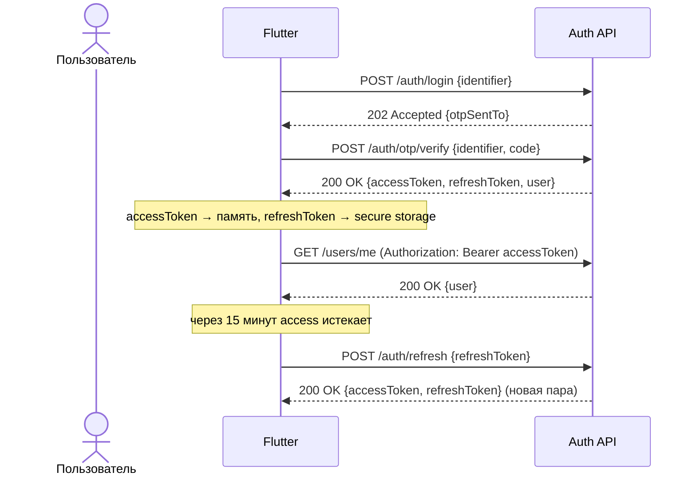

# REST API Specification: AI Finance

**Версия:** 0.1 (черновик для обсуждения)
**Автор:** Principal Architect
**Дата:** 2026-07-16
**Статус:** на согласование
**Связанные документы:** [06_Architecture.md](06_Architecture.md), [07_Database.md](07_Database.md)

> Спецификация REST API — не код, а контракт для параллельной разработки Flutter и NestJS команд. Ресурсы соответствуют таблицам из [07_Database.md](07_Database.md), поля отдаются в `camelCase` (маппинг из `snake_case` БД — на уровне DTO).

---

## 0. Базовые принципы

| Параметр | Значение |
|---|---|
| Base URL | `https://api.aifinance.kz/api/v1` |
| Формат данных | `application/json` (кроме загрузки файлов — `multipart/form-data`) |
| Аутентификация | `Authorization: Bearer <accessToken>` |
| Кодировка сумм | Строка с фиксированной точкой (`"12500.00"`), не `float` — исключает ошибки округления при сериализации |
| Даты | ISO 8601 (`"2026-07-16"` для дат, `"2026-07-16T10:32:00Z"` для timestamp'ов), всегда UTC |
| Locale ответов | Заголовок `Accept-Language: ru|kk|en` — влияет на тексты ошибок и AI-ответы, не на структуру данных |

---

## 1. Versioning

- **URI-версионирование**: `/api/v1/...`. Мажорная версия меняется только при breaking change (переименование/удаление поля, смена типа, изменение семантики статус-кода).
- Аддитивные изменения (новое опциональное поле, новый эндпоинт) **не** требуют новой версии.
- Устаревшая версия поддерживается минимум **6 месяцев** после публикации следующей мажорной версии.
- О депрекации сообщается заголовками ответа: `Deprecation: true`, `Sunset: Wed, 01 Jul 2026 00:00:00 GMT`, `Link: <https://docs.aifinance.kz/migration/v2>; rel="deprecation"`.
- Текущая LTS-версия: **v1** (данный документ).

---

## 2. Аутентификация и JWT

### Модель токенов

| Токен | Время жизни | Хранение на клиенте | Хранение на сервере |
|---|---|---|---|
| Access Token | 15 минут | В памяти (не в secure storage — короткоживущий) | Не хранится (stateless JWT, проверяется подписью) |
| Refresh Token | 30 дней | Secure storage (Keychain/Keystore) | Хэш в таблице `refresh_tokens` ([07_Database.md](07_Database.md)) |

- **Ротация refresh-токена**: каждый вызов `/auth/refresh` выдаёт **новую** пару access+refresh и отзывает (`revoked_at`) предыдущий refresh-токен. Повторное использование уже отозванного refresh-токена = сигнал компрометации → отзываются **все** активные сессии пользователя.
- **Payload access-токена**: `sub` (userId), `scope` (`full` | `guest`), `premiumStatus`, `iat`, `exp`, `jti`.
- **Guest-режим**: `/auth/guest` выдаёт access-токен с `scope: guest` без refresh-токена (сессия только на устройстве, не переживает переустановку) — реализация "продолжить без аккаунта" из [04_User_Flows.md](04_User_Flows.md).

### Поток входа (OTP)



### Эндпоинты

| Метод | Путь | Auth | Описание |
|---|---|---|---|
| POST | `/auth/register` | нет | Регистрация, отправка OTP |
| POST | `/auth/login` | нет | Вход, отправка OTP |
| POST | `/auth/otp/verify` | нет | Подтверждение OTP → выдача токенов |
| POST | `/auth/otp/resend` | нет | Повторная отправка кода (rate-limited) |
| POST | `/auth/refresh` | нет (refresh token в теле) | Обновление пары токенов |
| POST | `/auth/logout` | Bearer | Отзыв текущего refresh-токена |
| POST | `/auth/logout-all` | Bearer | Отзыв всех сессий пользователя |
| POST | `/auth/guest` | нет | Гостевая сессия без регистрации |
| POST | `/auth/guest/upgrade` | Bearer (guest) | Превращение гостя в полный аккаунт |

#### `POST /auth/register`
**Request body**

| Поле | Тип | Обяз. | Описание |
|---|---|---|---|
| identifier | string | да | Телефон (`+7...`) или email |
| locale | string (`ru`\|`kk`\|`en`) | нет, default `ru` | Язык интерфейса |

**Ответ `202 Accepted`**
```json
{ "data": { "otpSentTo": "+7 7** *** ** 12", "expiresInSeconds": 300 } }
```
**Ошибки:** `409 CONFLICT` (`USER_ALREADY_EXISTS`) — если телефон/email уже зарегистрирован (в этом случае клиенту предлагается перейти на `/auth/login`).

#### `POST /auth/otp/verify`
**Request body**

| Поле | Тип | Обяз. |
|---|---|---|
| identifier | string | да |
| code | string (6 цифр) | да |

**Ответ `200 OK`**
```json
{
  "data": {
    "accessToken": "eyJhbGciOi...",
    "refreshToken": "8f14e45f-...",
    "expiresIn": 900,
    "user": {
      "id": "3fa85f64-5717-4562-b3fc-2c963f66afa6",
      "phone": "+77071234567",
      "email": null,
      "name": null,
      "locale": "ru",
      "defaultCurrency": "KZT",
      "isNewUser": true
    }
  }
}
```
**Ошибки:** `400 OTP_INVALID`, `400 OTP_EXPIRED`, `429 TOO_MANY_ATTEMPTS` (после 5 неверных попыток, см. `otp_codes.attempts` в БД).

#### `POST /auth/refresh`
**Request:** `{ "refreshToken": "..." }` → **Ответ `200 OK`**: та же форма, что у `otp/verify`, без объекта `user`.
**Ошибки:** `401 TOKEN_REVOKED` (повторное использование отозванного токена → все сессии отозваны), `401 TOKEN_EXPIRED`.

#### `POST /auth/logout` / `POST /auth/logout-all`
**Request:** `{ "refreshToken": "..." }` (только для `/logout`) → **Ответ `204 No Content`**.

---

## 3. Общий формат ответа

### Успех — единичный ресурс
```json
{ "data": { "...": "..." } }
```

### Успех — список (пагинация, см. §4)
```json
{
  "data": [ { "...": "..." } ],
  "meta": { "nextCursor": "eyJpZCI6IjEyMyJ9", "hasMore": true, "limit": 20 }
}
```

### Ошибка
```json
{
  "error": {
    "code": "VALIDATION_ERROR",
    "message": "Сумма должна быть больше 0",
    "details": [ { "field": "amount", "issue": "must_be_positive" } ],
    "traceId": "b3d1c9a0-..."
  }
}
```
`traceId` пробрасывается в логи backend — обязателен в каждом ответе с 4xx/5xx для связки с QA/поддержкой.

---

## 4. Pagination

**Единый паттерн для всех списочных эндпоинтов — курсорная пагинация** (не offset/page): устойчива к вставке новых записей между запросами страниц (важно для лент, растущих в реальном времени — транзакции, уведомления, сообщения AI) и не деградирует по производительности на больших таблицах.

**Запрос:** `GET /transactions?limit=20&cursor=eyJpZCI6IjEyMyJ9`

| Query-параметр | Тип | По умолчанию | Описание |
|---|---|---|---|
| `limit` | int | 20 (max 100) | Размер страницы |
| `cursor` | string (opaque, base64) | — | Курсор из `meta.nextCursor` предыдущего ответа |

**Ответ:** см. формат списка выше. `hasMore: false` и отсутствие `nextCursor` — последняя страница. Курсор непрозрачен для клиента (внутри — `id` + значение поля сортировки), клиент не должен его парсить.

---

## 5. Ошибки — каталог кодов

| Код | HTTP | Когда возникает |
|---|---|---|
| `VALIDATION_ERROR` | 400 | Невалидное тело запроса (типы, форматы, обязательные поля) |
| `OTP_INVALID` / `OTP_EXPIRED` | 400 | Неверный/просроченный код подтверждения |
| `UNAUTHORIZED` | 401 | Отсутствует/невалиден access-токен |
| `TOKEN_EXPIRED` | 401 | Access-токен истёк — клиент должен вызвать `/auth/refresh` |
| `TOKEN_REVOKED` | 401 | Refresh-токен уже использован/отозван |
| `WEBHOOK_SIGNATURE_INVALID` | 401 | Подпись вебхука платёжного провайдера не прошла проверку |
| `PREMIUM_REQUIRED` | 403 | Действие требует Premium-тариф ([01_PRD.md §7](01_PRD.md#7-разделение-free--premium)) |
| `FORBIDDEN_ROLE` | 403 | Участник семейного бюджета с ролью `view` пытается изменить данные |
| `NOT_FOUND` | 404 | Ресурс не существует или не принадлежит пользователю |
| `CONFLICT` | 409 | Нарушение уникальности (дубликат бюджета на период, телефон уже занят) |
| `UNPROCESSABLE_BUSINESS_RULE` | 422 | Бизнес-правило нарушено (например, `co-owner = self`) |
| `RATE_LIMITED` | 429 | Превышен лимит запросов (AI Chat Free-тариф, повторная отправка OTP) |
| `AI_PROVIDER_UNAVAILABLE` | 503 | OpenAI/Vision/Whisper временно недоступны — клиент показывает retry, не ошибку ввода |
| `INTERNAL_ERROR` | 500 | Непредвиденная ошибка сервера |

Ошибка `PREMIUM_REQUIRED` **всегда** возвращает в `details` актуальный список тарифов (`{"plans": [...]}"`), чтобы клиент мог сразу отрисовать Paywall без дополнительного запроса.

---

## 6. Swagger / OpenAPI

- Генерируется автоматически из decorators `@nestjs/swagger` (`@ApiTags`, `@ApiOperation`, `@ApiResponse`, `@ApiBearerAuth`) — этот документ является источником правды для ручной сверки, а не заменяет автогенерацию.
- Доступен по `GET /api/v1/docs` (Swagger UI) и `GET /api/v1/docs-json` (сырой OpenAPI 3.1 JSON для генерации клиентских SDK/тестов).
- **Security scheme:** `bearerAuth` (HTTP, scheme `bearer`, `bearerFormat: JWT`), применяется глобально, кроме эндпоинтов из §2, помеченных `@ApiExcludeEndpoint` не используется — вместо этого `@Public()`-декоратор явно маркирует не защищённые роуты (безопаснее "explicit allow", чем "explicit deny").
- **Теги** соответствуют модулям из [06_Architecture.md §16](06_Architecture.md#16-модули): `Auth`, `Users`, `Accounts`, `Categories`, `Transactions`, `Budgets`, `Goals`, `Installments`, `Assets`, `RecurringPayments`, `Family`, `AI`, `OCR`, `Voice`, `Notifications`, `Payments`, `Sync`, `Reports`.
- В production Swagger UI закрыт Basic Auth (не для конечных пользователей), в staging/dev — открыт.

---

## 7. Users

| Метод | Путь | Auth | Описание |
|---|---|---|---|
| GET | `/users/me` | Bearer | Профиль текущего пользователя |
| PATCH | `/users/me` | Bearer | Обновить имя/локаль/валюту |
| DELETE | `/users/me` | Bearer | Мягкое удаление аккаунта + постановка в очередь полного стирания |

**`PATCH /users/me`** — тело: `{ "name"?, "locale"?, "defaultCurrency"? }` → `200 OK { "data": {User} }`.
**`DELETE /users/me`** → `202 Accepted { "data": { "scheduledPurgeAt": "2026-08-15T00:00:00Z" } }` (grace-период на случай передумал, соответствует UX-принципу из [05_UX.md §11](05_UX.md#11-settings-настройки)).

---

## 8. Accounts (Кошельки)

| Метод | Путь | Auth | Описание |
|---|---|---|---|
| GET | `/accounts` | Bearer | Список счетов (курсорная пагинация) |
| POST | `/accounts` | Bearer | Создать счёт |
| GET | `/accounts/{id}` | Bearer | Детали счёта |
| PATCH | `/accounts/{id}` | Bearer | Переименовать/архивировать |
| DELETE | `/accounts/{id}` | Bearer | Мягкое удаление |
| POST | `/accounts/{id}/adjust-balance` | Bearer | Ручная корректировка баланса |
| POST | `/accounts/import` | Bearer | Импорт выписки (`multipart/form-data`, поле `file`) |

**`POST /accounts`** — тело: `{ "type": "cash"|"bank"|"card"|"multi_currency", "name", "currency" }` → `201 Created`.

**Ресурс Account:**
```json
{
  "id": "uuid", "type": "bank", "name": "Kaspi Gold", "currency": "KZT",
  "balanceCached": "245300.00", "provider": "Kaspi Bank", "archived": false,
  "createdAt": "...", "updatedAt": "..."
}
```

**`POST /accounts/{id}/adjust-balance`** — тело: `{ "amount": "1500.00", "note": "Сверка баланса" }` → создаёт корректирующую транзакцию, `201 Created { "data": {Transaction} }`.

**`POST /accounts/import`** → `202 Accepted { "data": { "importId": "uuid", "status": "processing" } }`; статус опрашивается через `GET /accounts/import/{importId}` → `{ "status": "completed", "parsedTransactions": [...], "requiresConfirmation": true }`.

---

## 9. Categories

| Метод | Путь | Auth | Описание |
|---|---|---|---|
| GET | `/categories` | Bearer | Системные + кастомные категории пользователя |
| POST | `/categories` | Bearer | Создать кастомную категорию |
| PATCH | `/categories/{id}` | Bearer | Изменить (только кастомные) |
| DELETE | `/categories/{id}` | Bearer | Удалить (только кастомные, системные — `403 FORBIDDEN_ROLE`) |

**`POST /categories`** — `{ "name", "icon", "parentId"? }` → `201 Created { "data": {Category} }`.
**Ошибка:** `403 FORBIDDEN` при попытке изменить/удалить системную категорию (`user_id IS NULL` в БД).

---

## 10. Transactions

| Метод | Путь | Auth | Описание |
|---|---|---|---|
| GET | `/transactions` | Bearer | Список с фильтрами (курсорная пагинация) |
| POST | `/transactions` | Bearer | Создать транзакцию вручную |
| GET | `/transactions/{id}` | Bearer | Детали |
| PATCH | `/transactions/{id}` | Bearer | Редактировать |
| DELETE | `/transactions/{id}` | Bearer | Мягкое удаление |
| POST | `/transactions/{id}/confirm` | Bearer | Подтвердить черновик (после OCR/голоса), см. §13–14 |

**Query-параметры `GET /transactions`:** `accountId`, `categoryId`, `type` (`income`\|`expense`), `dateFrom`, `dateTo`, `limit`, `cursor`.

**`POST /transactions`** — тело:

| Поле | Тип | Обяз. |
|---|---|---|
| accountId | uuid | да |
| categoryId | uuid | нет |
| amount | string (decimal) | да |
| currency | string (ISO 4217) | да |
| type | `income`\|`expense` | да |
| occurredAt | date | нет, default сегодня |
| note | string ≤500 | нет |
| source | `manual`\|`ocr`\|`voice`\|`import` | нет, default `manual` |

→ `201 Created { "data": {Transaction} }`, где сервер **автоматически подставляет `categoryId`** через AI-категоризацию, если поле не передано (см. [06_Architecture.md §4](06_Architecture.md#4-ai)).

**Ошибки:** `400 VALIDATION_ERROR` (`amount <= 0`), `404 NOT_FOUND` (несуществующий `accountId`/`categoryId`).

---

## 11. Budgets

| Метод | Путь | Auth | Описание |
|---|---|---|---|
| GET | `/budgets` | Bearer | Список с рассчитанным прогрессом |
| POST | `/budgets` | Bearer | Создать бюджет |
| PATCH | `/budgets/{id}` | Bearer | Изменить лимит/период |
| DELETE | `/budgets/{id}` | Bearer | Удалить |

**Ресурс Budget** (поля `spentAmount`/`remainingAmount`/`progressPercent` — вычисляются на лету из `transactions`, не хранятся в БД):
```json
{
  "id": "uuid", "categoryId": "uuid", "categoryName": "Еда",
  "amountLimit": "80000.00", "period": "monthly", "startDate": "2026-07-01",
  "spentAmount": "56400.00", "remainingAmount": "23600.00", "progressPercent": 70
}
```
**Ошибка:** `409 CONFLICT` (`uq_budgets_user_category_period` — бюджет на эту категорию/период уже существует).

---

## 12. Goals

| Метод | Путь | Auth | Описание |
|---|---|---|---|
| GET | `/goals` | Bearer | Список целей |
| POST | `/goals` | Bearer | Создать цель |
| GET | `/goals/{id}` | Bearer | Детали + прогноз AI |
| PATCH | `/goals/{id}` | Bearer | Изменить |
| DELETE | `/goals/{id}` | Bearer | Удалить |
| POST | `/goals/{id}/contributions` | Bearer | Пополнить/снять |
| POST | `/goals/{id}/invite` | Bearer 💎 | Пригласить со-владельца |

**`GET /goals/{id}`** — ответ включает AI-прогноз:
```json
{
  "data": {
    "id": "uuid", "name": "Отпуск летом", "targetAmount": "600000.00",
    "currency": "KZT", "targetDate": "2027-06-01", "currentAmount": "180000.00",
    "progressPercent": 30, "coOwnerUserId": null,
    "aiForecast": { "projectedCompletionDate": "2027-08-14", "onTrack": false }
  }
}
```
**`POST /goals/{id}/invite`** — `{ "identifier": "+7..." }` → `202 Accepted`, требует Premium (иначе `403 PREMIUM_REQUIRED`).

---

## 13. Installments (Рассрочки)

| Метод | Путь | Auth | Описание |
|---|---|---|---|
| GET | `/installments` | Bearer | Карта всех рассрочек + суммарная нагрузка |
| POST | `/installments` | Bearer | Добавить рассрочку (генерирует график платежей) |
| GET | `/installments/{id}` | Bearer | Детали + вложенный график платежей |
| PATCH | `/installments/{id}` | Bearer | Изменить |
| DELETE | `/installments/{id}` | Bearer | Удалить |
| PATCH | `/installments/{id}/payments/{paymentId}` | Bearer | Отметить платёж оплаченным |
| POST | `/installments/calculator` | Bearer 💎 🤖 | Калькулятор "реальной стоимости" (без сохранения) |
| GET | `/installments/optimizer` | Bearer 💎 🤖 | AI-порядок погашения текущих рассрочек |

**`GET /installments`** → `200 OK`:
```json
{
  "data": {
    "totalOutstanding": "185000.00",
    "installments": [
      { "id": "uuid", "merchant": "Technodom", "totalAmount": "240000.00",
        "installmentsCount": 12, "provider": "Kaspi Rassrochka",
        "nextPayment": { "dueDate": "2026-07-18", "amount": "20000.00" } }
    ]
  }
}
```
**`POST /installments/calculator`** — `{ "price": "300000.00", "termMonths": 12 }` → `200 OK { "data": { "totalRepayment": "342000.00", "overpayment": "42000.00", "riskNote": "С учётом ваших 3 активных рассрочек это может привести к кассовому разрыву в марте." } }`.

---

## 14. Assets (Инвестиции)

| Метод | Путь | Auth | Описание |
|---|---|---|---|
| GET | `/assets` | Bearer 💎 | Список активов |
| POST | `/assets` | Bearer 💎 | Добавить актив |
| PATCH | `/assets/{id}` | Bearer 💎 | Обновить стоимость |
| DELETE | `/assets/{id}` | Bearer 💎 | Удалить |
| GET | `/assets/net-worth` | Bearer 💎 | Суммарный Net Worth по всем классам активов и обязательствам |

**`GET /assets/net-worth`**:
```json
{
  "data": {
    "netWorth": "12400000.00", "baseCurrency": "KZT",
    "breakdown": { "deposits": "5000000.00", "realEstate": "8000000.00", "stocks": "600000.00", "liabilities": "-1200000.00" },
    "realReturnYtd": 4.2
  }
}
```

---

## 15. Recurring Payments (Подписки)

| Метод | Путь | Auth | Описание |
|---|---|---|---|
| GET | `/recurring-payments` | Bearer | Обнаруженные регулярные платежи |
| PATCH | `/recurring-payments/{id}/dismiss` | Bearer | Пометить "это не подписка" |
| PATCH | `/recurring-payments/{id}/remind` | Bearer | Включить/выключить напоминание перед списанием |

Тело `PATCH .../remind`: `{ "enabled": true }` → `200 OK`.

---

## 16. Family (Семейный бюджет)

| Метод | Путь | Auth | Описание |
|---|---|---|---|
| POST | `/family/groups` | Bearer 💎 | Создать семейную группу |
| GET | `/family/groups/{id}` | Bearer | Детали группы |
| POST | `/family/groups/{id}/invite` | Bearer 💎 | Пригласить участника |
| POST | `/family/invites/{token}/accept` | Bearer | Принять приглашение |
| GET | `/family/groups/{id}/members` | Bearer | Список участников |
| DELETE | `/family/groups/{id}/members/{memberId}` | Bearer (только owner) | Исключить участника |

**`POST /family/groups/{id}/invite`** — `{ "identifier": "+7...", "role": "full"|"view" }` → `202 Accepted { "data": { "inviteToken": "..." } }`.
**Ошибка:** `403 FORBIDDEN_ROLE` — участник с ролью `view` пытается вызвать любой мутирующий эндпоинт группы.

---

## 17. AI

| Метод | Путь | Auth | Описание |
|---|---|---|---|
| POST | `/ai/conversations` | Bearer | Начать диалог |
| GET | `/ai/conversations/{id}/messages` | Bearer | История сообщений (курсорная пагинация) |
| POST | `/ai/conversations/{id}/messages` | Bearer 🆓 (лимит)/💎 | Отправить вопрос, получить ответ |
| GET | `/ai/insights` | Bearer | Лента проактивных инсайтов |

**`POST /ai/conversations/{id}/messages`** — тело: `{ "content": "Сколько я потратил на такси в июне?" }`

**Ответ `200 OK`:**
```json
{
  "data": {
    "message": {
      "id": "uuid", "role": "assistant",
      "content": "За июнь вы потратили 32 400 ₸ на такси — на 20% больше, чем в мае.",
      "relatedEntityType": "category", "relatedEntityId": "uuid-категории-такси",
      "createdAt": "2026-07-16T10:00:00Z"
    },
    "suggestedFollowUps": ["Как сократить траты на такси?", "Показать все операции по такси"]
  }
}
```
**Ошибки:** `429 RATE_LIMITED` (`{"details": {"remainingToday": 0, "resetsAt": "..."}}"` — Free-тариф), `503 AI_PROVIDER_UNAVAILABLE`.

**`GET /ai/insights`** → список карточек `{ "id", "type": "risk"|"tip"|"trend", "title", "body", "relatedEntityType", "relatedEntityId", "createdAt" }`.

---

## 18. OCR

| Метод | Путь | Auth | Описание |
|---|---|---|---|
| POST | `/ocr/scans` | Bearer 🆓 (лимит)/💎 | Загрузить чек на распознавание |
| GET | `/ocr/scans/{id}` | Bearer | Статус/результат скана |

**`POST /ocr/scans`** — тело: `{ "storagePath": "receipts/uuid.jpg" }` (файл предварительно загружен в Supabase Storage клиентом напрямую по signed URL — экономит трафик через backend).

**Ответ `201 Created` (синхронный путь, <3с):**
```json
{
  "data": {
    "receiptScanId": "uuid",
    "status": "processed",
    "draftTransaction": {
      "merchant": "Magnum", "amount": "12400.00", "currency": "KZT",
      "suggestedCategoryId": "uuid-категория-продукты",
      "lineItems": [ { "name": "Молоко 2.5%", "price": "650.00" } ]
    }
  }
}
```
**Ответ `202 Accepted` (асинхронный путь, если Vision API отвечает дольше порога):** `{ "data": { "receiptScanId": "uuid", "status": "processing" } }` → клиент опрашивает `GET /ocr/scans/{id}` или ждёт push-уведомление.

**Ошибки:** `403 PREMIUM_REQUIRED` (исчерпан дневной лимит Free), `422 UNPROCESSABLE_BUSINESS_RULE` (`code: RECEIPT_UNREADABLE`, чек не распознан — клиент открывает форму ручного ввода).

---

## 19. Voice

| Метод | Путь | Auth | Описание |
|---|---|---|---|
| POST | `/voice/transcriptions` | Bearer 💎 | Загрузить аудио, получить черновик транзакции |

**Request:** `multipart/form-data`, поле `audio` (aac/webm, ≤ 30 сек).

**Ответ `200 OK`:**
```json
{
  "data": {
    "transcript": "Потратил пять тысяч тенге на такси",
    "draftTransaction": { "amount": "5000.00", "currency": "KZT", "type": "expense", "suggestedCategoryId": "uuid" }
  }
}
```

---

## 20. Notifications & Devices

| Метод | Путь | Auth | Описание |
|---|---|---|---|
| GET | `/notifications` | Bearer | Лента (курсорная пагинация, `?unreadOnly=true`) |
| PATCH | `/notifications/{id}/read` | Bearer | Отметить прочитанным |
| PATCH | `/notifications/read-all` | Bearer | Отметить все прочитанными |
| POST | `/devices` | Bearer | Зарегистрировать устройство для push (идемпотентно) |
| DELETE | `/devices/{id}` | Bearer | Удалить устройство (логаут/переустановка) |

**`POST /devices`** — `{ "fcmToken": "...", "platform": "ios"|"android" }` → `200 OK` (upsert по `uq_devices_user_token`).

---

## 21. Payments / Premium

| Метод | Путь | Auth | Описание |
|---|---|---|---|
| GET | `/premium/status` | Bearer | Текущий статус подписки |
| POST | `/premium/kaspi/init` | Bearer | Инициировать оплату через Kaspi Pay |
| POST | `/premium/apple/validate` | Bearer | Валидация чека покупки Apple |
| POST | `/premium/google/validate` | Bearer | Валидация токена покупки Google |
| POST | `/webhooks/kaspi` | нет (подпись) | Callback Kaspi Pay |
| POST | `/webhooks/apple` | нет (подпись) | App Store Server Notifications V2 |
| POST | `/webhooks/google` | нет (подпись, Pub/Sub push) | Real-time Developer Notifications |

**`GET /premium/status`**:
```json
{ "data": { "plan": "premium_monthly", "status": "active", "provider": "kaspi", "renewsAt": "2026-08-16T00:00:00Z" } }
```
**`POST /premium/kaspi/init`** — `{ "plan": "premium_monthly"|"premium_yearly" }` → `201 Created { "data": { "paymentUrl": "https://pay.kaspi.kz/...", "qrCode": "data:image/png;base64,..." } }`.

**Вебхуки** — не JWT, а проверка подписи провайдера (см. [06_Architecture.md §7](06_Architecture.md#7-payments-apple--google--kaspi-pay)); неверная подпись → `401 WEBHOOK_SIGNATURE_INVALID`, обработка идемпотентна по `providerEventId` (повторная доставка вебхука не создаёт дублей).

---

## 22. Sync (Offline)

| Метод | Путь | Auth | Описание |
|---|---|---|---|
| GET | `/sync/pull` | Bearer | Получить изменения с сервера с курсора |
| POST | `/sync/push` | Bearer | Отправить локальные офлайн-операции |

**`GET /sync/pull?since=2026-07-15T00:00:00Z&cursor=...`**:
```json
{
  "data": {
    "changes": [
      { "entityType": "transaction", "entityId": "uuid", "operation": "upsert", "payload": {"...": "..."} },
      { "entityType": "budget", "entityId": "uuid", "operation": "delete" }
    ]
  },
  "meta": { "nextCursor": "...", "hasMore": false, "serverTime": "2026-07-16T10:05:00Z" }
}
```

**`POST /sync/push`** — тело:
```json
{
  "operations": [
    { "clientOperationId": "uuid-v4", "entityType": "transaction", "entityId": "uuid",
      "operation": "create", "payload": {"...": "..."}, "clientTimestamp": "2026-07-16T09:50:00Z" }
  ]
}
```
**Ответ `200 OK`:**
```json
{
  "data": {
    "applied": ["uuid-v4"],
    "conflicts": [],
    "serverChanges": []
  },
  "meta": { "nextCursor": "..." }
}
```
Идемпотентность по `clientOperationId` — повторная отправка того же батча (например, из-за обрыва связи после успешного ответа) не создаёт дублей. Стратегии конфликтов — см. [06_Architecture.md §9](06_Architecture.md#9-offline-sync).

---

## 23. Reports (Статистика)

| Метод | Путь | Auth | Описание |
|---|---|---|---|
| GET | `/reports/summary` | Bearer | Сводка за период |
| GET | `/reports/by-category` | Bearer | Разбивка по категориям |
| GET | `/reports/trends` | Bearer 💎 | Динамика категории во времени |
| GET | `/reports/heatmap` | Bearer 💎 | Тепловая карта трат по дням |
| POST | `/reports/export` | Bearer 💎 | Экспорт в PDF/Excel |

Общий query-параметр: `period` (`week`\|`month`\|`year`\|`custom` + `dateFrom`/`dateTo` при `custom`).

**`POST /reports/export`** — `{ "format": "pdf"|"xlsx", "period": "month", "dateFrom"?, "dateTo"? }` → `202 Accepted { "data": { "exportId": "uuid", "status": "processing" } }`, готовый файл — через `GET /reports/export/{exportId}` → `{ "status": "ready", "downloadUrl": "https://..." }` (ссылка на Supabase Storage с ограниченным сроком жизни).

---

## 24. Exchange Rates

| Метод | Путь | Auth | Описание |
|---|---|---|---|
| GET | `/exchange-rates/latest` | Bearer | Последний известный курс валютной пары |

**Query:** `base=USD&quote=KZT` → `200 OK { "data": { "base": "USD", "quote": "KZT", "rate": "480.120000", "rateDate": "2026-07-16" } }`.

---

## 25. Rate Limiting

| Ресурс | Лимит | Область |
|---|---|---|
| `POST /auth/otp/resend` | 3 запроса / 10 минут на identifier | Redis sliding window ([06_Architecture.md §15](06_Architecture.md#15-redis)) |
| `POST /ai/conversations/{id}/messages` | Free: 5 сообщений/день; Premium: без лимита | На пользователя |
| `POST /ocr/scans` | Free: 15 сканов/месяц; Premium: без лимита | На пользователя |
| Остальные эндпоинты | 120 запросов/минуту на пользователя (защита от аномального клиента) | Глобальный guard |

При превышении — `429 RATE_LIMITED` с заголовком `Retry-After` (секунды).

---

## 26. Итог / связь с остальной архитектурой

Все эндпоинты этого документа соответствуют модулям из [06_Architecture.md §16](06_Architecture.md#16-модули) и таблицам из [07_Database.md](07_Database.md) — новый эндпоинт не должен появляться без соответствующей записи в обоих документах. Следующий шаг — сгенерировать реальный `openapi.json` из NestJS-контроллеров и сверить его с этим документом как контрактным тестом (`docs-as-code` проверка в CI, см. [06_Architecture.md §11](06_Architecture.md#11-cicd-github-actions)).
