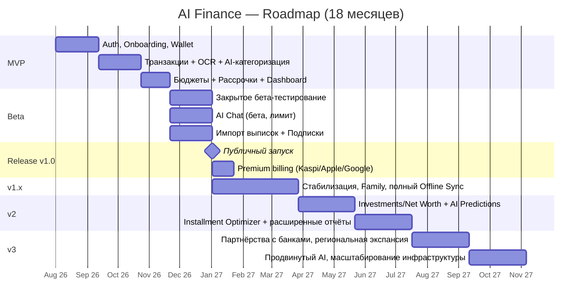

# Roadmap: AI Finance — 18 месяцев

**Версия:** 0.1 (черновик для обсуждения)
**Автор:** Product Manager
**Дата:** 2026-07-16
**Статус:** на согласование
**Связанные документы:** все предыдущие ([01](01_PRD.md)–[10](10_AI.md))

> Условная дата старта разработки — **август 2026**, горизонт — **январь 2028** (18 месяцев). Даты — плановые ориентиры для приоритизации, не контрактные обязательства.

---

## 0. Принципы планирования

- **Приоритизация — по пересечению трёх факторов**: (а) насколько боль острая у персон из [03_User_Personas.md](03_User_Personas.md), (б) насколько это незанятая ниша по [02_Market_Research.md](02_Market_Research.md) (рассрочки — выше приоритет, чем "ещё один трекер трат"), (в) техническая зависимость (нельзя строить AI Chat без базового Function Calling к транзакциям).
- **Правило CLAUDE.md**: каждая задача — максимум один рабочий день, план → подтверждение → тесты → документация. Месячные блоки ниже — это ориентир для роадмапа, внутри они дробятся на 2-недельные спринты с задачами такого размера силами исполнительных команд.
- **Release = v1.0.** Момент публичного запуска и версия v1.0 — одно и то же событие. Период сразу после запуска до готовности v2 называется здесь **«v1»** (v1.x — стабилизационные минорные версии).
- **Free-first при запуске.** MVP и Beta намеренно не монетизируются — сначала подтверждаем удержание и точность категоризации (см. [10_AI.md §14](10_AI.md#14-оценка-качества-evaluation)), затем включаем Premium к Release — ошибка монетизировать нерабочий продукт дороже, чем задержка на 1–2 месяца.

### Предположения о команде

Роадмап рассчитан на команду из [CLAUDE.md](../CLAUDE.md): 1 PM, 1 BA, 1 UX + 1 UI (частично совмещены), 2 Flutter, 2 NestJS, 1 AI Engineer, 1 DevOps (частичная занятость до Beta), 1 QA. При меньшем составе сроки фаз пропорционально сдвигаются — цифры ниже не масштабируются линейно с добавлением людей (Brooks' Law), поэтому расширение команды в первую очередь для распараллеливания независимых модулей (Flutter feature-модули из [06_Architecture.md §16](06_Architecture.md#16-модули)), не для ускорения последовательных зависимостей.

---

## 1. Обзорная диаграмма

---

## 2. MVP — Месяцы 1–4 (авг–ноя 2026)

**Цель:** доказать ключевую петлю ценности — быстрая фиксация траты → понятная картина бюджета — на закрытой внутренней аудитории, без публичного релиза и без монетизации.

### Входит

| Область | Что делаем |
|---|---|
| Auth | OTP-вход по телефону, гостевой режим ([08_API.md §2](08_API.md#2-аутентификация-и-jwt)) |
| Onboarding | Выбор языка, value-экраны, первичная настройка ([04_User_Flows.md §2–4](04_User_Flows.md#2-первый-запуск-и-onboarding)) |
| Wallet | Наличные + ручные счета, **без** мультивалютности и без live-синхронизации банков |
| Транзакции | Ручной ввод, OCR чека (Google Vision), базовая AI-категоризация ([10_AI.md §2](10_AI.md#2-ocr)) |
| Категории | Системный набор, локализованный RU/KZ |
| Бюджеты | Помесячные лимиты по категории |
| Рассрочки | Ручное добавление + календарь платежей + push-напоминания (**без** AI-калькулятора и оптимизатора — они в v2) |
| Dashboard / Статистика | Остаток бюджета, круговая диаграмма по категориям |
| Backend-модули | `AuthModule`, `UsersModule`, `AccountsModule`, `CategoriesModule`, `TransactionsModule`, `BudgetsModule`, `InstallmentsModule`, `NotificationsModule` (только push по рассрочкам), `OcrModule` |
| Инфраструктура | Dev docker-compose, базовый CI (lint+test), staging-окружение |

### Не входит

AI Chat, голосовой ввод, Цели накопления, Инвестиции, Семейный бюджет, Подписки (детекция), импорт банковских выписок, Premium/платежи, мультивалютность.

### Критерий выхода из фазы

Внутренняя команда + 20–30 приглашённых пользователей (персоны 2, 3, 8, 14 — приоритетные по [03_User_Personas.md](03_User_Personas.md)) используют приложение ежедневно 2 недели подряд без критичных багов; точность AI-категоризации ≥ 80% на живых данных (ниже целевых 90% из [10_AI.md §14](10_AI.md#14-оценка-качества-evaluation) — это MVP-порог, не финальный).

---

## 3. Beta — Месяцы 5–6 (дек 2026 – янв 2027)

**Цель:** закрытое тестирование на внешней аудитории (несколько сотен–пара тысяч человек), подтвердить удержание и себестоимость AI до публичного запуска.

### Входит (дополнительно к MVP)

- **Цели накопления** (базовая версия, 1 цель на Free)
- **AI Chat** — бета-флаг, дневной лимит, только read-функции ([10_AI.md §11](10_AI.md#11-function-calling)): `get_transactions`, `get_budget_status`, `get_goals`, `get_installments_summary`
- **Импорт банковских выписок** (PDF/CSV) — ключевое УТП против Mewnay ([02_Market_Research.md](02_Market_Research.md))
- **Обнаружение подписок** (`RecurringPaymentsModule`, еженедельный cron)
- **Голосовой ввод** — русский язык, казахский помечен экспериментальным ([10_AI.md §3](10_AI.md#3-voice))
- Полноценный Offline Sync (Outbox pattern, [06_Architecture.md §9](06_Architecture.md#9-offline-sync)) — критично для персоны "Житель региона"
- Инфраструктура Premium **готовится**, но не включена публично (Kaspi Pay/Apple/Google интеграция тестируется в sandbox)
- Аналитика/крашлитика, канал обратной связи в приложении

### Распространение

TestFlight + Firebase App Distribution, закрытый список приглашённых (реферальная волна от MVP-когорты + таргетированный набор персон 3/8/11/13 через локальные сообщества).

### Критерий выхода из фазы (go/no-go на Release)

- Retention D30 ≥ отраслевой ориентир для финтех-приложений (целевой порог фиксируется отдельно с BA на основе первых чисел, не выдуман здесь заранее)
- Точность AI-категоризации ≥ 90% (целевой порог из [10_AI.md §14](10_AI.md#14-оценка-качества-evaluation))
- Стоимость AI на активного пользователя в день — в пределах модели ценообразования из [02_Market_Research.md §4](02_Market_Research.md#4-цены-подписок-сравнительная-таблица) ($15–40/год на пользователя должно с запасом покрывать AI-costs + инфраструктуру)
- Ни одного критичного инцидента безопасности/потери данных

---

## 4. Release / v1.0 — Месяц 7 (фев 2027)

**Цель:** публичный запуск в App Store / Google Play, Free-тариф полностью открыт, Premium монетизация включена.

### Входит (дополнительно к Beta)

- **Premium billing вживую**: Kaspi Pay (основной канал) + Apple/Google IAP, Entitlement Service, вебхуки провайдеров ([06_Architecture.md §7](06_Architecture.md#7-payments-apple--google--kaspi-pay))
- AI Chat — общая доступность (Free: лимит/день, Premium: без лимита)
- OCR — общая доступность (Free: лимит/месяц, Premium: без лимита)
- **Семейный бюджет** (Premium) — приглашение участника, роли `full`/`view`
- Полная Статистика (тренды, heatmap — Premium; базовые графики — Free)
- Публичные страницы магазинов приложений, лендинг, ASO

### Go/No-Go чек-лист перед публикацией

- [ ] Юридическая проверка Paywall-формулировок и Terms of Service
- [ ] Нагрузочное тестирование Payments webhooks (пиковая нагрузка при промо)
- [ ] Прод CI/CD с ручным подтверждением деплоя ([06_Architecture.md §11](06_Architecture.md#11-cicd-github-actions))
- [ ] On-call дежурство настроено (хотя бы PM + 1 backend)

---

## 5. v1 — Месяцы 8–10 (мар–май 2027)

**Цель:** стабилизация после публичного запуска — реакция на реальные данные использования важнее новых фич.

### Фокус

- Исправление проблем удержания/багов, выявленных на реальном масштабе (не в закрытой бете)
- Донастройка AI-промптов и few-shot примеров на основе живых данных категоризации ([10_AI.md §14](10_AI.md#14-оценка-качества-evaluation))
- Масштабирование инфраструктуры под реальный трафик (реплики `api`/`worker`, см. [06_Architecture.md §10](06_Architecture.md#10-docker))
- Донастройка ценообразования Premium по факту конверсии (может отличаться от гипотезы в [02_Market_Research.md](02_Market_Research.md))
- Локализация казахского языка — доведение голосового ввода с "экспериментального" статуса до полноценного, если метрики WER позволяют ([10_AI.md §3](10_AI.md#3-voice))

**Явно не добавляем крупных новых модулей в этой фазе** — это осознанное решение: после Release приоритет — устойчивость, а не расширение поверхности продукта.

---

## 6. v2 — Месяцы 11–14 (июн–сен 2027)

**Цель:** вторая крупная волна ценности — финансовая глубина для персон "Инвестор" и "IT-специалист", более умный AI.

### Входит

| Область | Что делаем |
|---|---|
| Investments / Net Worth | Полноценный раздел активов, разбивка по классам, реальная доходность с поправкой на инфляцию ([10_AI.md §8](10_AI.md#8-investment-assistant)) — **после** юридической проверки формулировок (риск из [10_AI.md §15](10_AI.md#15-итог--следующие-шаги)) |
| Installment Optimizer | AI-калькулятор "реальной стоимости" покупки + AI-оптимизатор порядка погашения ([10_AI.md §11](10_AI.md#11-function-calling)) |
| Predictions | Прогноз кассового разрыва, адаптивный недельный бюджет для нерегулярного дохода ([10_AI.md §5](10_AI.md#5-predictions-прогнозы)) |
| Расширенные отчёты | Экспорт PDF/Excel, произвольные периоды |
| Со-владение целями | Общая цель на двоих с уведомлениями о вкладах партнёра (персона "Пара перед крупной покупкой") |

### Зависимости

Requires: юридическое согласование раздела Инвестиций (блокирующая задача — должна стартовать в начале v1, не в начале v2, т.к. занимает время параллельно с разработкой).

---

## 7. v3 — Месяцы 15–18 (окт 2027 – янв 2028)

**Цель:** масштаб и подготовка следующего горизонта роста — не разработка ради разработки, а обоснованные шаги к расширенному TAM.

### Входит

| Область | Что делаем |
|---|---|
| Партнёрства с банками | Исследование и, при готовности партнёра, интеграция официального API вместо парсинга PDF/CSV (снижает хрупкость импорта, см. риск в [01_PRD.md §8](01_PRD.md#8-ключевые-риски-и-открытые-вопросы)) |
| Региональная экспансия (подготовка) | Локализация под расширенный TAM Центральной Азии ([02_Market_Research.md §2.1](02_Market_Research.md#21-tam-total-addressable-market)) — язык/валюта/локальные категории, без полного маркетингового запуска в этой фазе |
| Продвинутый AI | Более глубокая персонализация рекомендаций на основе накопленной истории (см. принципы AI-памяти в [10_AI.md §10](10_AI.md#10-memory)), улучшение голосового ввода на казахском до паритета с русским |
| Масштабирование БД | Партиционирование `transactions` при достижении порога объёма, обозначенного в [07_Database.md §10](07_Database.md#10-дальнейшие-шаги) |
| Зрелость DevOps | Полноценный мониторинг/алертинг, дежурство 24/7 при достижении соответствующего масштаба пользователей |

---

## 8. Метрики успеха по фазам

| Фаза | Ключевая метрика | Ориентир |
|---|---|---|
| MVP | Ежедневное использование внутренней когортой | 2 недели подряд без критичных багов |
| Beta | Retention D30, точность категоризации | Точность ≥ 90% ([10_AI.md §14](10_AI.md#14-оценка-качества-evaluation)) |
| Release | Установки за первый месяц | В рамках траектории Года 1 из [02_Market_Research.md §2.3](02_Market_Research.md#23-som-serviceable-obtainable-market) (~20–25 тыс. на конец Года 1 — Release занимает часть этого окна, не весь год) |
| v1 | Стабильность (crash-free rate), конверсия Free→Premium | Конверсия в коридоре 5–8%, заложенном в SOM-модели |
| v2 | Глубина вовлечения (доля пользователей с ≥3 активными модулями: бюджет+цель+рассрочка) | Растёт относительно v1 |
| v3 | Суммарная база пользователей к месяцу 18 | Ориентировочно между Годом 1 и Годом 2 SOM-траектории (~40–90 тыс.) — 18 месяцев не совпадают ровно с границами "финансового года" в модели Market Research, поэтому ориентир — интервал, не точка |

---

## 9. Риски и межфазовые зависимости

| Риск/зависимость | Затрагивает | Митигирование |
|---|---|---|
| Юридическая проверка Investment Assistant не начата вовремя | Блокирует v2 | Стартовать проверку в начале фазы v1, параллельно разработке |
| Качество голосового ввода на казахском ниже ожиданий | v1 (решение о статусе "эксперимент → полноценный") | Метрики WER собираются с Beta, решение — по данным, не по дате |
| Kaspi Pay интеграция не готова к Release | Блокирует монетизацию | Начинать sandbox-интеграцию в Beta, не в Release |
| Точность категоризации не достигает 90% к концу Beta | Может отложить Release | Go/no-go чек-лист явно требует этот порог — короткая задержка предпочтительнее плохого первого впечатления |
| Партнёрство с банком (v3) зависит от внешней стороны, не только от команды | v3 | Формулируется как "исследование и готовность", а не жёсткое обязательство на фиксированную дату |

---

## 10. Итог

MVP и Beta — намеренно долгий (6 месяцев) путь до первого публичного релиза ради проверки главной гипотезы продукта (точная AI-категоризация + быстрый ввод удерживают пользователя) до того, как деньги и репутация поставлены на кон. v1–v3 после этого — не хаотичное добавление фич из PRD по порядку, а последовательность, продиктованная зависимостями (юридическая проверка перед Инвестициями) и тем, что уже показал реальный рынок в Beta/Release, а не тем, что казалось важным на этапе исследования.

Следующий шаг — BA декомпозирует MVP (раздел 2) на конкретные user stories и 2-недельные спринты для старта разработки.
