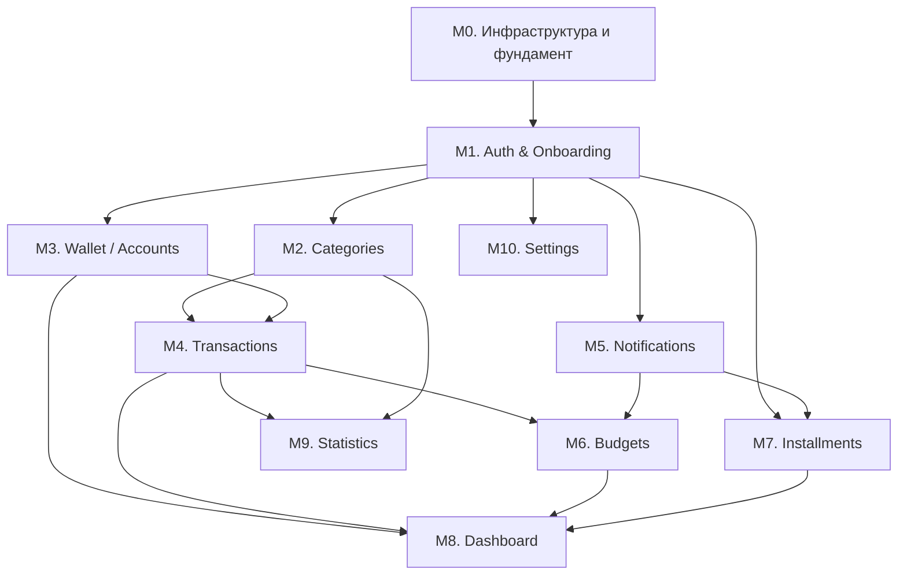

# Техническое задание: MVP AI Finance

**Версия:** 0.1 (черновик для обсуждения)
**Авторы:** Product Manager + Business Analyst (синтез всей подготовленной документации)
**Дата:** 2026-07-16
**Статус:** на согласование
**Источники:** [01_PRD.md](01_PRD.md) · [02_Market_Research.md](02_Market_Research.md) · [03_User_Personas.md](03_User_Personas.md) · [04_User_Flows.md](04_User_Flows.md) · [05_UX.md](05_UX.md) · [06_Architecture.md](06_Architecture.md) · [07_Database.md](07_Database.md) · [08_API.md](08_API.md) · [09_Design_System.md](09_Design_System.md) · [10_AI.md](10_AI.md) · [11_Roadmap.md](11_Roadmap.md) · [12_Backlog.md](12_Backlog.md)

> Документ — исполняемое ТЗ для фазы **MVP** ([11_Roadmap.md §2](11_Roadmap.md#2-mvp--месяцы-14-авгноя-2026), месяцы 1–4, внутренняя альфа без публичного релиза и без монетизации). Код не приводится — только цели, контракты, модели данных и критерии приёмки. Каждый модуль соответствует эпику из [12_Backlog.md §2](12_Backlog.md#2-mvp--эпики-p0) (маркировка `Epic Eх`).

---

## 0. Область охвата MVP

### Входит

Auth (OTP + гость) · Onboarding · Wallet (наличные/ручные счета, без мультивалюты) · Транзакции (ручной ввод + OCR + AI-категоризация) · Категории (системные + кастомные) · Бюджеты (помесячные) · Рассрочки (ручной ввод + календарь + напоминания, без AI-калькулятора) · Dashboard · Статистика (базовая, круговая диаграмма) · Настройки (профиль/язык/уведомления) · Инфраструктура (Docker/CI/staging).

### Не входит (осознанно отложено на Beta/v1/v2, см. [11_Roadmap.md](11_Roadmap.md))

AI Chat, голосовой ввод, Цели накопления, Импорт банковских выписок, Обнаружение подписок, Offline Sync (полный), Premium/платежи, Семейный бюджет, Инвестиции, мультивалютность.

### Целевые персоны MVP

Персоны 2 (Молодая семья), 3 (Фрилансер), 8 (Таксист/гиг-работник), 14 (Долговая ловушка рассрочек) — см. [03_User_Personas.md](03_User_Personas.md) и обоснование выбора в [11_Roadmap.md §2](11_Roadmap.md#2-mvp--месяцы-14-авгноя-2026).

---

## 1. Модули и порядок реализации

MVP разбит на **11 независимых модулей**. "Независимый" означает: у модуля свой набор экранов, свой backend-модуль ([06_Architecture.md §16](06_Architecture.md#16-модули)), свои таблицы БД и свой набор тестов — модуль можно полностью закончить, протестировать и принять до начала следующего. Зависимости — только "снизу вверх" (модуль использует то, что уже готово, не наоборот).

**Рекомендованный порядок исполнения:** M0 → M1 → (M2 и M3 параллельно) → M4 → M5 → (M6 и M7 параллельно) → M8 → (M9 и M10 параллельно, могут идти и раньше M8, если есть свободные руки — оба зависят только от более ранних модулей).

---

## 2. M0 — Инфраструктура и фундамент

*(соответствует Epic E9 в [12_Backlog.md](12_Backlog.md#epic-e9-infrastructure-mvp-baseline))*

### Цель

Поднять минимальную техническую платформу, на которой можно писать и проверять продуктовый код с первого дня — без неё ни один другой модуль не тестируется в реалистичных условиях.

### Экраны

Нет продуктовых экранов. Технический Splash-плейсхолдер (см. [05_UX.md §2](05_UX.md#2-splash)) как часть Flutter-каркаса.

### API

`GET /health` — health-check для CI/оркестрации (единственный публичный эндпоинт этого модуля).

### Модели данных

Инфраструктура миграций (расширения `pgcrypto`, ENUM-типы, функция `set_updated_at()` — [07_Database.md §2–4](07_Database.md#2-расширения)). Ни одной продуктовой таблицы — они появляются по мере готовности соответствующих модулей.

### Тесты

- CI: прогон lint + typecheck + пустого набора тестов на "hello world" эндпоинте
- `docker-compose up` поднимает `api`+`worker`+`postgres`+`redis` без ошибок на чистой машине
- Миграция накатывается и откатывается (`up`/`down`) без ошибок на пустой БД

### Критерии приёмки

- [ ] `docker-compose up` работает локально у всех разработчиков команды без ручных доп. шагов
- [ ] PR не мёржится в `main` при красном CI
- [ ] Успешный merge автодеплоит `api` в Staging
- [ ] `GET /health` возвращает `200` в Staging

### Зависимости

Нет (первый модуль).

---

## 3. M1 — Auth & Onboarding

*(Epic E1)*

### Цель

Пользователь проходит путь от первого запуска до входа в приложение за ≤60 секунд без обязательной привязки банка — реализация принципа "постепенное доверие" ([05_UX.md §0](05_UX.md#0-принципы-ux)).

### Экраны

Splash → Выбор языка → Onboarding value-экраны (3) → Регистрация/Вход → Ввод OTP → Первичная настройка (валюта, цель использования) — полное описание в [04_User_Flows.md §2–4](04_User_Flows.md#2-первый-запуск-и-onboarding) и [05_UX.md §2–3](05_UX.md#2-splash).

### API

Из [08_API.md §2](08_API.md#2-аутентификация-и-jwt) и §7:

| Метод | Путь |
|---|---|
| POST | `/auth/register` |
| POST | `/auth/login` |
| POST | `/auth/otp/verify` |
| POST | `/auth/otp/resend` |
| POST | `/auth/refresh` |
| POST | `/auth/logout` |
| POST | `/auth/guest` |
| POST | `/auth/guest/upgrade` |
| GET | `/users/me` |
| PATCH | `/users/me` |

### Модели данных

`users`, `refresh_tokens`, `otp_codes` — полные определения в [07_Database.md §5.1–5.3](07_Database.md#51-users). Ключевые ограничения: `chk_users_has_identifier` (телефон или email обязателен), `chk_otp_attempts` (максимум 5 попыток).

### Тесты

- Unit: валидация формата телефона/email (`chk_users_phone_format`), логика ротации refresh-токена
- Integration: полный цикл `register → otp/verify → refresh → logout`; повторное использование отозванного refresh-токена отзывает все сессии
- Integration: 6-я неверная попытка OTP возвращает `429`, а не `400`
- Widget-тесты (Flutter): переход между экранами онбординга, обработка ошибки "неверный код"

### Критерии приёмки

- [ ] Новый пользователь регистрируется по телефону и подтверждает код за один проход
- [ ] Гостевой режим доступен без ввода телефона и позволяет пользоваться приложением локально
- [ ] Access-токен обновляется прозрачно для пользователя при истечении
- [ ] Выбранный язык (RU/KZ/EN) применяется немедленно ко всем экранам
- [ ] Профиль (`GET /users/me`) отдаёт корректные `locale`/`defaultCurrency` после первичной настройки

### Зависимости

M0.

---

## 4. M2 — Categories

*(Epic E4)*

### Цель

Обеспечить транзакции и бюджеты готовым, локализованным набором категорий с первого использования — без этого шага пользователь не может ничего категоризировать.

### Экраны

Отдельного полноэкранного раздела в MVP нет — категории представлены компонентом **выбора категории** (сетка иконок, Bottom Sheet) внутри форм добавления транзакции (M4) и создания бюджета (M6), с инлайн-действием "+ Своя категория".

### API

Из [08_API.md §9](08_API.md#9-categories):

| Метод | Путь |
|---|---|
| GET | `/categories` |
| POST | `/categories` |
| PATCH | `/categories/{id}` |
| DELETE | `/categories/{id}` |

### Модели данных

`categories` — [07_Database.md §5.4](07_Database.md#54-categories). Системные категории — `user_id IS NULL`, уникальны по имени (`ux_categories_system_name`); пользовательские — уникальны в рамках пользователя (`ux_categories_user_name`).

### Тесты

- Unit: попытка изменить/удалить системную категорию → `403 FORBIDDEN`
- Integration: seed-скрипт создаёт системные категории один раз, повторный запуск не дублирует
- Integration: создание кастомной категории с именем, совпадающим с чужой пользовательской, не конфликтует (уникальность в рамках `user_id`)

### Критерии приёмки

- [ ] При первом запуске у любого пользователя доступен полный локализованный (RU/KZ) набор системных категорий
- [ ] Пользователь может создать минимум одну свою категорию с иконкой
- [ ] Системную категорию нельзя удалить или переименовать через API

### Зависимости

M1 (нужен `user_id` для кастомных категорий).

---

## 5. M3 — Wallet (Accounts)

*(Epic E2)*

### Цель

Дать пользователю единое место, где физически "лежат" деньги (наличные, ручные счета) — предпосылка для любой транзакции.

### Экраны

Карусель счетов (верх Wallet/Dashboard) + список операций по счёту + экран деталей счёта + Bottom Sheet добавления счёта ("Наличные"/"Ручной счёт") — [05_UX.md §5](05_UX.md#5-wallet-кошелёк). Мультивалютные кошельки и импорт выписок — **вне MVP** (Beta/Premium).

### API

Из [08_API.md §8](08_API.md#8-accounts-кошельки) — без `POST /accounts/import` (переносится в Beta, Epic E12):

| Метод | Путь |
|---|---|
| GET | `/accounts` |
| POST | `/accounts` |
| GET | `/accounts/{id}` |
| PATCH | `/accounts/{id}` |
| DELETE | `/accounts/{id}` |
| POST | `/accounts/{id}/adjust-balance` |

### Модели данных

`accounts` — [07_Database.md §5.5](07_Database.md#55-accounts). В MVP `type` ограничен значениями `cash`/`bank`/`card` (ручной ввод), `multi_currency` — не используется до Beta+.

### Тесты

- Unit: `chk_accounts_currency` отклоняет невалидный код валюты
- Integration: удаление счёта — мягкое (`deleted_at`), связанные транзакции не исчезают из истории, но счёт пропадает из активного списка
- Integration: `adjust-balance` создаёт корректирующую транзакцию с пометкой источника

### Критерии приёмки

- [ ] Пользователь может добавить счёт "Наличные" за один шаг без обязательных полей, кроме названия
- [ ] Список счетов на Dashboard/Wallet отражает актуальный баланс каждого счёта
- [ ] Архивирование счёта скрывает его из карусели, но не удаляет историю операций

### Зависимости

M1.

---

## 6. M4 — Transactions (ручной ввод + OCR + AI-категоризация)

*(Epic E3 — самый крупный модуль MVP)*

### Цель

Дать пользователю зафиксировать любую трату за секунды тремя способами (вручную, фото чека, из шаблона) с автоматической категоризацией — ядро ценностного предложения продукта ([01_PRD.md §3](01_PRD.md#3-боли-пользователей), боль "деньги утекают, а я не понимаю куда").

### Экраны

Выбор способа ввода (Bottom Sheet) → Ручная форма / Экран сканирования чека (камера → предпросмотр распознанного) → Подтверждение → Лента транзакций с фильтрами и свайп-действием смены категории — [05_UX.md §6](05_UX.md#6-добавление-транзакции), [04_User_Flows.md §6](04_User_Flows.md#6-добавление-транзакции). Голосовой ввод — **вне MVP** (Beta, Epic E14).

### API

Из [08_API.md §10](08_API.md#10-transactions) и §18:

| Метод | Путь |
|---|---|
| GET | `/transactions` |
| POST | `/transactions` |
| GET | `/transactions/{id}` |
| PATCH | `/transactions/{id}` |
| DELETE | `/transactions/{id}` |
| POST | `/ocr/scans` |
| GET | `/ocr/scans/{id}` |

### Модели данных

`transactions`, `receipt_scans` — [07_Database.md §5.6–5.7](07_Database.md#56-receipt_scans). Ключевые ограничения: `chk_transactions_amount_positive` (сумма всегда > 0, знак — через `type`), `ux_transactions_receipt_scan` (1 чек → максимум 1 транзакция).

### AI-компонент (см. [10_AI.md §2 и §9](10_AI.md#2-ocr))

- OCR: Google Vision → структурирование через OpenAI (structured output) → предложенная категория
- Категоризация ручных транзакций: промпт из Prompt Registry, кэш в Redis по `hash(merchant+amount)`, порог `confidence < 0.5` → категория не проставляется автоматически

### Тесты

- Unit: `amount <= 0` отклоняется на уровне DTO до похода в БД
- Integration: `POST /ocr/scans` с нечитаемым изображением возвращает `422 RECEIPT_UNREADABLE`, не `500`
- Integration: одинаковый мерчант+сумма второй раз не порождает повторный вызов OpenAI (проверка по логам/счётчику вызовов — кэш сработал)
- Integration: курсорная пагинация ленты транзакций не теряет и не дублирует записи при вставке новой транзакции между запросами страниц
- Widget-тесты: Bottom Sheet выбора способа ввода, экран камеры с деградацией при отказе в доступе к камере

### Критерии приёмки

- [ ] Ручная транзакция сохраняется не более чем за 3 тапа от открытия Bottom Sheet
- [ ] Фото чека даёт структурированный черновик (сумма/мерчант/категория) за ≤3 секунды в 90% случаев на тестовом наборе чеков
- [ ] Точность автокатегоризации ≥ 80% на живых данных внутренней альфы (целевой порог для MVP, ниже финальных 90% из [10_AI.md §14](10_AI.md#14-оценка-качества-evaluation))
- [ ] Свайп по строке транзакции в ленте меняет категорию без открытия отдельного экрана
- [ ] Удалённая транзакция не отображается в ленте, но данные физически сохранены (`deleted_at`)

### Зависимости

M1, M2 (категория), M3 (счёт).

---

## 7. M5 — Notifications (push-инфраструктура)

*(часть Epic E6/E9, вынесена в отдельный модуль — используется бюджетами и рассрочками)*

### Цель

Обеспечить техническую возможность довести до пользователя предупреждение (лимит бюджета, платёж по рассрочке) — сквозная инфраструктура, а не отдельная продуктовая фича.

### Экраны

Нет отдельного экрана в MVP (полноценный "Центр уведомлений" — Beta+); пуш приходит как системное уведомление устройства и/или запись в БД, доступная через будущий эндпоинт списка.

### API

Из [08_API.md §20](08_API.md#20-notifications--devices):

| Метод | Путь |
|---|---|
| POST | `/devices` |
| DELETE | `/devices/{id}` |
| GET | `/notifications` |
| PATCH | `/notifications/{id}/read` |

### Модели данных

`devices`, `notifications` — [07_Database.md §5.19–5.20](07_Database.md#519-notifications). Уникальность `uq_devices_user_token` — регистрация идемпотентна.

### Тесты

- Integration: повторная регистрация того же `fcmToken` не создаёт дубликат устройства (upsert)
- Integration: удаление устройства (логаут) прекращает доставку push на него
- Unit: payload push собирается корректно для двух типов уведомлений MVP (лимит бюджета, платёж по рассрочке)

### Критерии приёмки

- [ ] Устройство регистрируется автоматически при первом входе
- [ ] Push доставляется на все активные устройства пользователя (fan-out)
- [ ] Логаут удаляет регистрацию устройства

### Зависимости

M1.

---

## 8. M6 — Budgets

*(Epic E5)*

### Цель

Дать пользователю простой помесячный лимит по категории и понятный прогресс — закрывает боль "не понимаю, сколько ещё можно потратить" без терминологии в духе YNAB ([01_PRD.md §3.6](01_PRD.md#3-боли-пользователей)).

### Экраны

Список бюджетов с прогресс-барами (цветовая индикация зелёный/жёлтый/красный) + Bottom Sheet создания/редактирования — [05_UX.md §6](05_UX.md#6-statistics-статистикаотчёты) (Dashboard-виджет) и отдельный полноэкранный список.

### API

Из [08_API.md §11](08_API.md#11-budgets):

| Метод | Путь |
|---|---|
| GET | `/budgets` |
| POST | `/budgets` |
| PATCH | `/budgets/{id}` |
| DELETE | `/budgets/{id}` |

### Модели данных

`budgets` — [07_Database.md §5.8](07_Database.md#58-budgets). `spentAmount`/`remainingAmount`/`progressPercent` вычисляются на лету из `transactions`, не хранятся. `uq_budgets_user_category_period` не допускает дублирующийся бюджет на категорию/период.

### Тесты

- Unit: расчёт `progressPercent` на граничных значениях (0%, 100%, >100% — допустимый перерасход)
- Integration: попытка создать второй бюджет на ту же категорию/период → `409 CONFLICT`
- Integration: пересечение порога 80%/100% лимита создаёт ровно одно уведомление за период (не дублируется при каждой новой транзакции)

### Критерии приёмки

- [ ] Пользователь создаёт бюджет на категорию за один Bottom Sheet
- [ ] Прогресс-бар корректно отражает потраченное относительно лимита в реальном времени после каждой новой транзакции
- [ ] При приближении к лимиту приходит push-уведомление (через M5)

### Зависимости

M2, M4, M5.

---

## 9. M7 — Installments (базовая версия)

*(Epic E6 — ключевой дифференциатор продукта, см. [02_Market_Research.md §7](02_Market_Research.md#7-выводы-и-рекомендации))*

### Цель

Показать пользователю сводную картину всех активных рассрочек и предстоящих платежей одним экраном — единственная полностью незанятая ниша среди всех проанализированных конкурентов. AI-калькулятор "реальной стоимости" и оптимизатор погашения — **вне MVP** (v2, Epic E24).

### Экраны

Сводная карта рассрочек (суммарная долговая нагрузка + карточки активных рассрочек + календарь платежей) + добавление рассрочки (Bottom Sheet) — [05_UX.md §8](05_UX.md#8-трекер-рассрочек--bnpl-ключевое-утп-).

### API

Из [08_API.md §13](08_API.md#13-installments-рассрочки), без `calculator`/`optimizer` (v2):

| Метод | Путь |
|---|---|
| GET | `/installments` |
| POST | `/installments` |
| GET | `/installments/{id}` |
| PATCH | `/installments/{id}` |
| DELETE | `/installments/{id}` |
| PATCH | `/installments/{id}/payments/{paymentId}` |

### Модели данных

`installments`, `installment_payments` — [07_Database.md §5.11–5.12](07_Database.md#511-installments). При создании рассрочки backend автоматически генерирует `installments_count` записей платежей с датами (шаг = месяц от `start_date`).

### Тесты

- Unit: генерация графика платежей — сумма всех `installment_payments.amount` равна `total_amount` с точностью до округления последнего платежа
- Integration: cron-задача (`ix_installment_payments_due_pending`) создаёt уведомление за 1–3 дня до `due_date` только для статуса `pending`
- Integration: отметка платежа оплаченным не меняет прошлые/будущие платежи графика

### Критерии приёмки

- [ ] Пользователь видит суммарную долговую нагрузку по всем рассрочкам на одном экране
- [ ] Добавление рассрочки автоматически строит календарь платежей
- [ ] Push-напоминание приходит за 1–3 дня до платежа (через M5)
- [ ] Отметка "оплачено" обновляет статус конкретного платежа, не весь график

### Зависимости

M1, M5.

---

## 10. M8 — Dashboard

*(Epic E7)*

### Цель

Ответить на главный вопрос пользователя ("сколько у меня денег и что происходит с бюджетом") за 2 секунды без единого тапа — агрегирующий экран поверх уже готовых модулей.

### Экраны

Единственный экран Dashboard: остаток бюджета периода, виджет ближайшего платежа по рассрочке, превью 2–3 "горячих" бюджетов, лента последних операций — [05_UX.md §4](05_UX.md#4-dashboard). AI-инсайт карточка — **вне MVP** (Beta, требует AI Chat инфраструктуру Epic E11), заменяется на Dashboard заглушкой/CTA.

### API

Dashboard не имеет собственных эндпоинтов — агрегирует данные из `GET /accounts`, `GET /budgets`, `GET /installments`, `GET /transactions` (последние N). Решение сознательное: не создавать отдельный `GET /dashboard` эндпоинт в MVP, чтобы не дублировать логику агрегации, которая и так есть в существующих эндпоинтах — Flutter-клиент собирает экран из уже готовых вызовов.

### Модели данных

Не вводит новых таблиц — читает существующие.

### Тесты

- Widget-тест: корректная отрисовка при пустых данных (Empty-состояние нового пользователя, [05_UX.md §12](05_UX.md#12-empty-states))
- Widget-тест: параллельная загрузка 4 источников данных не блокирует отрисовку уже готовых виджетов (частичный skeleton, не всё-или-ничего)
- Integration (E2E): pull-to-refresh обновляет все виджеты разом

### Критерии приёмки

- [ ] Экран открывается и показывает основной остаток бюджета менее чем за 1 секунду на закэшированных данных (skeleton — на первичной загрузке)
- [ ] У нового пользователя без данных отображается осмысленное Empty-состояние с CTA, а не пустой экран
- [ ] Виджет ближайшего платежа по рассрочке скрыт полностью, если активных рассрочек нет

### Зависимости

M3, M4, M6, M7.

---

## 11. M9 — Statistics (базовая)

*(Epic E8)*

### Цель

Дать наглядный ответ "на что уходят деньги" одной круговой диаграммой — расширенная аналитика (тренды, heatmap, экспорт) вне MVP (Release/v1.0, Epic E19).

### Экраны

Экран статистики: переключатель периода (неделя/месяц/год) + круговая диаграмма по категориям + текстовый вывод-инсайт над графиком — [05_UX.md §6](05_UX.md#6-statistics-статистикаотчёты).

### API

Из [08_API.md §23](08_API.md#23-reports-статистика), только базовый эндпоинт:

| Метод | Путь |
|---|---|
| GET | `/reports/summary` |
| GET | `/reports/by-category` |

### Модели данных

Не вводит новых таблиц — агрегирует `transactions` по `category_id`.

### Тесты

- Unit: агрегация сумм по категориям корректна на граничных случаях (одна категория, транзакции без категории — группируются в "Без категории")
- Integration: смена периода пересчитывает диаграмму без лишних запросов (кэш периода на клиенте)
- Widget-тест: палитра диаграммы соответствует [09_Design_System.md §11](09_Design_System.md#11-charts) (фиксированный порядок хью, не циклится)

### Критерии приёмки

- [ ] Диаграмма строится корректно для периодов "неделя"/"месяц"/"год"
- [ ] Тап по сектору диаграммы фильтрует ленту транзакций по этой категории
- [ ] Текстовый вывод над графиком отражает реальный тренд ("категория X — самая быстрорастущая"), а не статичный текст

### Зависимости

M2, M4.

---

## 12. M10 — Settings

*(не выделен отдельным эпиком в Backlog — минимальный набор, необходимый для завершённости MVP)*

### Цель

Дать пользователю базовый контроль над профилем, языком и уведомлениями — минимально необходимая полнота приложения для внутренней альфы.

### Экраны

Настройки: профиль (имя, телефон/email), язык, валюта по умолчанию, уведомления (гранулярные тумблеры), удаление аккаунта — сокращённая версия [05_UX.md §11](05_UX.md#11-settings-настройки) (без разделов "Тариф"/"Счета и семейный доступ"/"Безопасность (биометрия)" — вне MVP).

### API

Из [08_API.md §7](08_API.md#7-users):

| Метод | Путь |
|---|---|
| GET | `/users/me` |
| PATCH | `/users/me` |
| DELETE | `/users/me` |

### Модели данных

Использует `users` (уже создана в M1), новых таблиц не вводит.

### Тесты

- Integration: смена языка в настройках немедленно влияет на локаль последующих ответов API, где это применимо (тексты ошибок)
- Integration: `DELETE /users/me` переводит аккаунт в `202 Accepted` с `scheduledPurgeAt`, не удаляет данные мгновенно

### Критерии приёмки

- [ ] Пользователь может сменить язык интерфейса без перезапуска приложения
- [ ] Пользователь может инициировать удаление аккаунта и видит дату фактического удаления
- [ ] Отключение уведомлений о лимите бюджета не требует более одного тапа (см. запрет "тёмных паттернов" в [05_UX.md §11](05_UX.md#11-settings-настройки))

### Зависимости

M1.

---

## 13. Итоговый чек-лист готовности MVP

Совпадает с критерием выхода из фазы в [11_Roadmap.md §2](11_Roadmap.md#2-mvp--месяцы-14-авгноя-2026):

- [ ] Все 11 модулей приняты по своим критериям приёмки (разделы 2–12)
- [ ] Внутренняя команда + 20–30 приглашённых пользователей (персоны 2/3/8/14) используют приложение ежедневно 2 недели подряд без критичных багов
- [ ] Точность AI-категоризации ≥ 80% на живых данных
- [ ] CI/CD (M0) стабильно зелёный, Staging доступен всей команде
- [ ] Ни одного открытого блокирующего дефекта в модулях M1/M3/M4 (Auth/Wallet/Transactions — без них приложение не функционально в принципе)

**Следующий шаг:** после закрытия чек-листа — переход к фазе Beta ([11_Roadmap.md §3](11_Roadmap.md#3-beta--месяцы-56-дек-2026--янв-2027)), разворачивающей Goals, AI Chat, импорт выписок и Offline Sync поверх уже стабильного MVP-фундамента.
